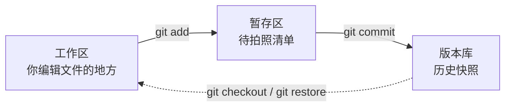

# 04. 拿捏 Git 与 GitHub<!-- omit in toc -->

**定位**：从零开始掌握版本控制和开源协作，让你的代码有历史、有备份、有观众。

**核心目标**：学完本课程，你将能独立用 Git 管理自己的项目，用 GitHub 开源发布你的代码，并参与开源社区的协作。

---

## 目录<!-- omit in toc -->

- [前言：为什么你的代码需要一个“时光机”](#前言为什么你的代码需要一个时光机)
- [第一章：Git 是什么？——你的代码时光机](#第一章git-是什么你的代码时光机)
  - [1.1 没有 Git 的世界：毕业论文的地狱版本号](#11-没有-git-的世界毕业论文的地狱版本号)
  - [1.2 Git 是如何实现版本管理的？](#12-git-是如何实现版本管理的)
  - [1.3 Git 和 GitHub 是什么？](#13-git-和-github-是什么)
  - [1.4 安装 Git](#14-安装-git)
  - [1.5 仓库是什么？—— `git init` 创建你的第一个仓库](#15-仓库是什么-git-init-创建你的第一个仓库)
- [第二章：第一次提交 —— 你的代码里程碑](#第二章第一次提交--你的代码里程碑)
  - [2.1 工作区、暂存区、版本库：Git 的三个“房间”](#21-工作区暂存区版本库git-的三个房间)
  - [2.2 添加文件到暂存区：`git add` 到底做了什么](#22-添加文件到暂存区git-add-到底做了什么)
  - [2.3 查看文件状态：`git status` 告诉你什么变了](#23-查看文件状态git-status-告诉你什么变了)
  - [2.4 提交：`git commit` 把改动写进历史](#24-提交git-commit-把改动写进历史)
  - [2.5 提交说明怎么写：好习惯从第一条 `commit message` 开始](#25-提交说明怎么写好习惯从第一条-commit-message-开始)
  - [2.6 修改文件和提交：重复上面的循环](#26-修改文件和提交重复上面的循环)
  - [2.7 动手：给守夜者笔记仓库做第一次提交](#27-动手给守夜者笔记仓库做第一次提交)
- [第三章：查看历史——你的代码都经历了什么](#第三章查看历史你的代码都经历了什么)
  - [3.1 `git log`：查看所有提交记录](#31-git-log查看所有提交记录)
  - [3.2 `git diff`：看看你改了哪一行](#32-git-diff看看你改了哪一行)
  - [3.3 `git show`：查看某一次提交的具体内容](#33-git-show查看某一次提交的具体内容)
  - [3.4 动手：查看守夜者笔记的提交历史](#34-动手查看守夜者笔记的提交历史)
- [第四章：撤销与回滚——后悔药怎么吃](#第四章撤销与回滚后悔药怎么吃)
  - [4.1 修改最后一次提交：`git commit --amend`](#41-修改最后一次提交git-commit---amend)
  - [4.2 撤销 `git add`：把文件从暂存区撤回来](#42-撤销-git-add把文件从暂存区撤回来)
  - [4.3 撤销工作区的修改：`git restore` 找回被改坏的文件](#43-撤销工作区的修改git-restore-找回被改坏的文件)
  - [4.4 回滚到历史版本：`git reset` 和 `git revert` 的区别](#44-回滚到历史版本git-reset-和-git-revert-的区别)
  - [4.5 动手：故意把代码改坏，再把它救回来](#45-动手故意把代码改坏再把它救回来)
- [第五章：分支——平行世界的你](#第五章分支平行世界的你)
  - [5.1 为什么需要分支：同时写笔记和修 bug 的场景](#51-为什么需要分支同时写笔记和修-bug-的场景)
  - [5.2 创建和切换分支：`git branch` 和 `git switch`](#52-创建和切换分支git-branch-和-git-switch)
  - [5.3 合并分支：`git merge` 把两条线合成一条](#53-合并分支git-merge-把两条线合成一条)
  - [5.4 解决冲突：当两条分支改动了同一个文件](#54-解决冲突当两条分支改动了同一个文件)
  - [5.5 分支策略：`main` 放稳定版，`dev` 放开发版](#55-分支策略main-放稳定版dev-放开发版)
  - [5.6 动手：在分支上写教程，写完了合并回主线](#56-动手在分支上写教程写完了合并回主线)
- [第六章：GitHub——把你的代码托管到云上](#第六章github把你的代码托管到云上)
  - [6.1 什么是 GitHub：不只是代码仓库，还是程序员的社交网络](#61-什么是-github不只是代码仓库还是程序员的社交网络)
  - [6.2 注册 GitHub 账号，创建你的第一个远程仓库](#62-注册-github-账号创建你的第一个远程仓库)

<!--
  - [6.3 关联远程仓库：`git remote add` 和 `git push`](#63-关联远程仓库git-remote-add-和-git-push)
  - [6.4 推送和拉取：`git push` 和 `git pull` 的完整循环](#64-推送和拉取git-push-和-git-pull-的完整循环)
  - [6.5 动手：把《守夜者笔记》推送到 GitHub](#65-动手把守夜者笔记推送到-github)
- [第七章：协作——和其他人一起写代码](#第七章协作和其他人一起写代码)
  - [7.1 Fork：把别人的仓库复制到自己的账号下](#71-fork把别人的仓库复制到自己的账号下)
  - [7.2 Clone：把远程仓库拉取到本地](#72-clone把远程仓库拉取到本地)
  - [7.3 Pull Request：向原仓库贡献你的修改](#73-pull-request向原仓库贡献你的修改)
  - [7.4 Issues：提 bug、提建议、讨论问题的地方](#74-issues提-bug提建议讨论问题的地方)
  - [7.5 开源协作礼仪：如何礼貌地参与一个开源项目](#75-开源协作礼仪如何礼貌地参与一个开源项目)
  - [7.6 动手：Fork 一个开源项目，提交你的第一个 Pull Request](#76-动手fork-一个开源项目提交你的第一个-pull-request)
- [第八章：GitHub Pages——免费的静态网站托管](#第八章github-pages免费的静态网站托管)
  - [8.1 什么是 GitHub Pages：你的仓库就是一个网站](#81-什么是-github-pages你的仓库就是一个网站)
  - [8.2 发布你的 README 为网站](#82-发布你的-readme-为网站)
  - [8.3 用 GitHub Pages 搭建你的个人博客](#83-用-github-pages-搭建你的个人博客)
  - [8.4 动手：把《守夜者笔记》发布到 GitHub Pages](#84-动手把守夜者笔记发布到-github-pages)
- [第九章：Git 高级技巧——那些让你效率翻倍的命令](#第九章git-高级技巧那些让你效率翻倍的命令)
  - [9.1 `.gitignore`：告诉 Git 哪些文件不用管](#91-gitignore告诉-git-哪些文件不用管)
  - [9.2 `git stash`：暂存当前未完成的工作](#92-git-stash暂存当前未完成的工作)
  - [9.3 `git rebase`：整理你的提交历史](#93-git-rebase整理你的提交历史)
  - [9.4 `git tag`：给重要版本打标签](#94-git-tag给重要版本打标签)
  - [9.5 动手：整理《守夜者笔记》的提交历史，发布第一个版本标签](#95-动手整理守夜者笔记的提交历史发布第一个版本标签)
- [第十章：总结与展望](#第十章总结与展望)
  - [10.1 你学会了什么？](#101-你学会了什么)
  - [10.2 接下来怎么继续练习 Git 和 GitHub？](#102-接下来怎么继续练习-git-和-github)
  - [10.3 用 Git 管理你的所有项目](#103-用-git-管理你的所有项目)
-->

---

## 前言：为什么你的代码需要一个“时光机”

*Kate 在 03 学完了 Vim。她看着自己电脑上那些文件——`毕业论文_最终版.doc`、`毕业论文_最终版2.doc`、`毕业论文_打死也不改版.doc`——摇了摇头。她说：*

> *“这些文件名……我以前就是这么存文档的。每一版都另存一个新文件，文件名字越来越长，最后自己也分不清哪一版才是最新的。改了一次，怕改坏了，又不敢把旧文件删掉——结果桌面上堆了十几个版本。”*
>
> “你现在知道你缺什么了吗？”
>
> *“一个能帮我记住每一版改了什么的工具？”*
>
> “对。它叫 Git。你用 Markdown 写笔记、用 VS Code 编辑、用 Vim 在服务器上改配置——但你没有 Git，你的所有文件都是‘一次性’的。改坏了就是改坏了，没有后悔药。Git 给你的文件装上时光机。”

**为什么你需要 Git？**  

你写笔记、写教程、写代码——文件在变。今天加一段，明天删一行，后天改个错别字。没有 Git，你只能用“另存为”来保存不同版本。三个月后你回头找“昨天下午那个还没改崩的版本”，发现桌面上有 15 个文件，名字从 `最终版` 到 `最终版7` 到 `打死也不改版` 到 `真的不改版` 到 `再改是狗`。

Git 把你从这种泥潭里拉出来。它记录的是**修改历史**，不是文件的完整副本。你每完成一次阶段性改动，就做一次“提交”（commit）。Git 记录下这次提交的所有修改——哪个文件改了、改了哪一行、什么时候改的、谁改的。以后任何时候，你可以回顾任何一次提交，对比任意两次提交之间的差异，把文件恢复到任何一个历史状态。你不再需要“另存为”了——你只需要做一次提交，Git 就帮你记住了那一刻的文件状态。

但 Git 的价值不只在于“后悔药”。Git 还有一个更深远的意义：**让协作成为可能**。你不是一个人在写东西。你和其他人共同维护一个项目——每个人在自己的电脑上修改文件，通过 Git 把修改合并到一起，同时保留每个人改了什么、什么时候改的、为什么这样改。没有 Git，协作只能靠“发文件给我，我改完发给你”。有了 Git，全世界几百万程序员可以同时维护同一个项目——你能想象这是怎么办到的吗？答案就在这本教程里。

**这本教程怎么带你学 Git？**  

Git 的核心操作不多——`init`、`add`、`commit`、`log`、`diff`、`restore`、`branch`、`merge`、`push`、`pull`。十个命令，覆盖了你 90% 的工作。但 Git 不是靠背命令学会的。它是一套**工作流**——一种组织文件修改的方式。你需要在一个真实的项目里反复练习，直到这些命令成为你的肌肉记忆。

每一个学 Git 的人都应该在真实项目上练习。这本教程的每一个“动手”环节都围绕**《守夜者笔记》仓库**展开。第一章你创建仓库，第二章你第一次提交，第三章你查看历史，第四章你撤销和回滚，第五章你在分支上写教程，第六章你把它推送到 GitHub，第七章你参与开源协作，第八章你把它发布成网站，第九章你整理提交历史、发布版本标签。

到第十章结束时，你的《守夜者笔记》仓库已经推送到了 GitHub，有了完整的提交历史，甚至被发布到了 GitHub Pages。你不再是一个只会写文件的作者——你是一个用 Git 管理项目、用 GitHub 托管项目、用 Pull Request 参与开源协作的开发者。

**前置知识**  

你不需要任何编程基础。你只需要会使用终端——在 05 第三章你已经学过基本的命令行操作，知道怎么 `cd` 切换目录、怎么输入命令、怎么看输出。你在 01 学过 Markdown，你的所有笔记和教程都是 `.md` 文件。Git 天生适合管理 Markdown 文件——纯文本格式让 Git 能精确追踪每一行改动，你在 01 里踩过的 Markdown 空格坑，Git 一眼就能帮你找出来。

**怎么学？**  

每一章先讲概念，再动手练习。概念部分只讲你当下需要知道的——不多也不少。动手部分用《守夜者笔记》仓库做主线项目，每一步都踩在前一步的基础上。

你不需要一次全懂。Git 的学习曲线不是一条直线——它像爬山，有一些陡坡。`分支`和`合并`是很多人的卡点。没关系，卡住了就回到动手环节，把命令再敲一遍。Git 不是在脑子里学会的，是在手指上学会的。

> *Kate 打开终端，看到光标在闪。她说：“来吧，给我的《守夜者笔记》装上时光机。”*
>
> *“好。第一章，我们先认识一下 Git——你的代码时光机。”*

---

## 第一章：Git 是什么？——你的代码时光机

*Kate 在前言里看到了那些“毕业论文_最终版.doc”的故事。她问了一个问题：*

> *“我确实在用‘另存为’管理版本，而且效果很糟。但 Git 真的能解决这个问题吗？它到底是怎么记录我的每一次修改的？”*
>
> “好问题。这一节先让你看到没有 Git 的世界有多痛苦，然后告诉你 Git 是怎么把这个问题解决掉的。”

---

### 1.1 没有 Git 的世界：毕业论文的地狱版本号

假如你在写毕业论文。第一天，你写好了初稿，保存为 `论文.doc`。

- 第二天，导师说“第一章的引言要改一下”。你改了，怕改坏，把新版本另存为 `论文_修改版.doc`。

- 第三天，导师说“引用格式不对”。你改了，又另存为 `论文_修改版2.doc`。

- 第四天，导师说“参考文献太少，加十篇”。你改了，又另存为 `论文_修改版3.doc`。

- 第五天，导师说“还是用回修改版2的引言，但保留修改版3的参考文献”。你打开 `论文_修改版2.doc`，复制引言，打开 `论文_修改版3.doc`，粘贴引言，重新整理，另存为 `论文_最终版.doc`。

- 第六天，导师说“这个最终版的基础还是有问题，用回修改版1，但加上修改版2的第三章”。你开始打开三个文件对照着看，眼睛在三个窗口之间来回扫，试图手动合并不同版本的优点。此时你的桌面上有：

```text
论文.doc
论文_修改版.doc
论文_修改版2.doc
论文_修改版3.doc
论文_最终版.doc
论文_最终版2.doc
论文_打死也不改版.doc
论文_真的不改版.doc
论文_再改是狗.doc
```

九个文件，每个文件里都有一些“这一段是好的，那一段是废的”。你不知道哪个文件是最新的，不知道哪个文件里哪个段落是你要的，不知道“修改版2”和“最终版”之间到底差了什么。你只知道一件事：**再这样下去要疯了。**

> *Kate 说：“我看着我自己的桌面——就是这样的。每个版本都留着，因为不敢删。但每个版本之间差了哪几行，我完全不知道。我只能一个一个打开对比。”*
>
> “这就是没有 Git 的世界。你保存的是文件的**完整副本**——每个版本都是完整的一份，版本之间差了什么，全靠你肉眼对比。文件越多，越乱，越不敢删，越不知道哪个是最新的。”

**Git 解决这个问题的方式完全不同。**

Git 不保存“完整副本”。它保存的是**修改记录**。

你写好了初稿，做一次提交——Git 记录下整个文件的当前状态，给它拍了一张“快照”，标上“这是第一版”。

你改了引言，做一次提交——Git 记录下**你改了哪些行**，以及“这是第二版，基于第一版改的”。

你改了引用格式，做一次提交——Git 记录下**你改了哪些行**，以及“这是第三版，基于第二版改的”。

你加了十篇参考文献，做一次提交——Git 记录下**你改了哪些行**，以及“这是第四版，基于第三版改的”。

现在你可以做这些事：

- **查看任何一个历史版本**：一条命令，回到“第一版”的状态——初稿，什么都没有改。
- **对比任意两个版本**：一条命令，显示“第二版和第三版之间到底差了什么”——哪一行被改了、改成什么了。
- **回到任何一个版本**：你觉得第四版写砸了，一条命令，文件恢复到第三版。
- **合并不同版本的修改**：导师说“用第三版的引言，但要保留第四版的参考文献”——Git 帮你自动合并，你只需要处理冲突的部分。

你的桌面上不再有九个文件了。你只有一个文件——`论文.md`（用 Markdown 写，你已经在 01 学过了）。和它一起的，是一长串提交记录，每条记录都告诉你“这次改了什么、为什么改、什么时候改的”。这不是九个文件——这是一条时间线。你可以在时间线上自由穿梭。

> *Kate 说：“所以 Git 不是‘自动保存’——自动保存是保存最新版。Git 是保存**每一个版本**，并且记住版本之间的关系。我把论文比作一条河，Git 就是河上的桥——我可以在任何一个桥墩上停下来，看看那时候河水的样子。”*

---

### 1.2 Git 是如何实现版本管理的？

*Kate 在上一节看到了 Git 能做什么。她靠在椅背上，想了一会儿，然后说：*

> *“我知道了 Git 能回到任何历史版本、能对比不同版本的差异。但我有点好奇——它到底是怎么做到的？它是不是把我的每个版本都完整存了一份？那我的硬盘不是早就爆了？”*
>
> “这个问题问得很有档次。Git 的实现方式确实不是‘每个版本存一份完整副本’。它用了一套很巧妙的设计。我不给你讲代码，只讲思想——这套思想，是你理解 Git 所有行为的关键。”

**核心思想：快照，而不是差异**  

大多数版本管理系统的思路是：**记录文件每次改了什么**。就像记账：

```text
版本1：有 A、B、C 三个文件
版本2：A 文件第 3 行加了 xxx，B 文件删了
版本3：C 文件改了 yyy
```

Git 不这么干。Git 的思路是：**每次提交，直接给整个项目拍一张“全家福”。**

你没看错，是**整个项目**。所有文件的当前状态，咔嚓一下，全存下来。

这时候你肯定想：这不得把硬盘撑爆？

这就是 Git 最精妙的地方。

**文件的“身份证”：内容指纹**  

Git 不给文件起名字——它给每个文件的**内容**计算一串独特的字符。这串字符叫“哈希值”。它有两个特性：

1. **唯一性**：同样的内容，永远算出同一串字符。内容哪怕改了一个标点，算出来的字符就完全不一样了。
2. **不可逆**：从这串字符反推不出文件内容。

这串字符，就成了文件内容的“指纹”。指纹一样，内容就一样。指纹不一样，内容一定改过了。

**怎么存？——“只要指纹没变，就不用再存一遍”**  

当你提交一个新版本时，Git 会遍历项目里所有文件：

- **对于内容没变的文件**：它的指纹跟上一个版本一样。Git 说：“这个文件我仓库里已经有了，不用再存了，记个引用就行。”
- **对于内容变了的文件**：计算新的指纹，把新内容存进去。

所以，你看起来 Git 给每个版本都拍了“整个项目的快照”，实际上，**那些没变动的文件，只是在新快照里记了个引用，并没有占用新的存储空间。**

这就像你每年拍一张全家福。照片上的人，今年和去年长得一样，就不用重新“制造”这个人——在照片上标注“还是去年那个人”就行。只有变了的人，才需要更新。

**版本本身长什么样？——一条链子**  

每次提交，Git 都会创建一个“提交记录”。这个记录里存着四样东西：

1. 这个版本的项目快照——项目里所有文件的指纹
2. 作者和时间——谁在什么时候提交的
3. 提交说明——你写的 commit message
4. **指向上一个版本的指针**——关键！它记住了“我是基于哪一个版本改出来的”

这个“指向上一个版本”的设计，让所有版本串联成了一条链子：

```text
A → B → C → D
↑   ↑   ↑   ↑
v1  v2  v3  v4
```

每个节点都是那个时刻完整项目的快照。你想回到 B 版本？Git 只需要找到 B 这个提交记录，然后根据它记录的文件指纹，把所有文件还原出来。

这就是**时空穿越**的本质。不是“撤销”了改动，而是重新“播放”了那个瞬间的一切。

**分支：只是一个会移动的指针**  

你之前听过“分支”这个词吗？在 Git 里，分支简单得让人吃惊。

Git 有一个特殊指针叫 `HEAD`，它指向你当前在哪个位置。而一个分支名（比如 `main`、`dev`），本质上就是一个**指向某个提交记录的指针。**

当你新建一个分支并提交时：

- Git 创建一个新的提交记录，它的“上一个版本”指向你当时所在的那个版本
- 然后把分支指针移到这个新提交上

两个分支共享着相同的“历史基础”，只是因为指针指向了不同的提交，就可以各自往下生长。分支不是一个副本——它只是一个标签，贴在某一个版本上。

**合并为什么通常很轻松？**

因为 Git 的合并，不是比对你的文件和我的文件“哪里不一样”。而是：

> **找到两个分支的共同起点，然后看：**  
> “从起点到我，改了这些文件。”  
> “从起点到你，改了这些文件。”  
>
> ——如果我们改的是不同文件，或者同一个文件的不同位置，Git 直接自动合并。只有我们改了同一个文件的同一行，Git 才会说：“我搞不定了，你来吧。”（这就是“冲突”。）

**总结：Git 的版本管理，是一套“基于内容指纹的智能档案库”**  

它不是给文件编号，不是存差异，而是：

> **用文件内容的指纹作为索引，构建了一个“只要没变，就不用重存”的智能档案库。然后用链子组织版本，用指针管理分支。**

所以，Git 的仓库为什么这么“瘦”？因为它**几乎不存重复的东西**。为什么可以随便建分支？因为**分支只是一个指针，几乎是零成本**。为什么可以飞速穿梭历史？因为它还原一个版本，就是把那个时刻的“文件指纹”指过去——瞬间完成。

你所有的代码、回滚、分支、合并，背后都是这套优雅的、基于指纹的“时空档案系统”在默默运转。

从这个角度看，Git 与其说是一个版本管理工具，不如说是一座用指纹建造的“时间博物馆”。每一个 commit，都是那个时刻你项目的完美复制品，静静地躺在馆里，等待你随时穿越回去。

> *Kate 听完，沉默了几秒。然后她说：“所以 Git 不存重复的东西——它只存变化的文件。没变的文件，它就记一句‘和上个版本一样’。这就像一个聪明的图书管理员，不会把同一本书抄十遍，只是在目录里标注‘这本书在 A 书架第三层’。”*
>
> “对。而且这个图书管理员有一双极其敏锐的眼睛——文件内容哪怕改了一个标点，它都能立刻认出来。凭的就是那个内容指纹。指纹一样就是一样，不一样就是不一样，没有模棱两可。”
>
> *“……那这个图书管理员住在我电脑上吗？我怎么才能用到它？”*
>
> “它确实住在你电脑上——但它不是图形界面，是一个命令行工具。而且它有一个孪生兄弟叫 GitHub，专门负责把你的时间博物馆放到网上，让全世界都能看到。下一节，我们先把 Git 和 GitHub 这两个东西分清楚，然后把它们请到你的电脑上。”

下一节，我们要学习 **Git 和 GitHub 是什么**——一个是你电脑上的版本管理工具，一个是托管仓库的网站。很多人把它俩混为一谈，但它们是完全不同的两样东西。🔪

---

### 1.3 Git 和 GitHub 是什么？

> *“我大概明白了——Git 是一个聪明的图书管理员，用指纹识别文件变化，给项目建了一座时间博物馆。但我还有一个问题：Git 和 GitHub 是一回事吗？我总听人把这两个词连在一起说，好像它们是同一个东西。”*
>
> “好问题。这一节把这两个名字拆开，顺便说说 Git 是从哪来的。”

#### 1.3.1 什么是版本管理？<!-- omit in toc -->

在讲 Git 和 GitHub 之前，先把“版本管理”这个词说清楚。你在 1.1 节已经感受过没有版本管理的痛苦——九个毕业论文文件，不知道哪个是最新的。版本管理，就是**帮你管理文件每一次改动的工具**。

你写的每一篇笔记、每一章教程、每一段代码，都在不停变化。今天加一段，明天删一行，后天改个错别字。版本管理工具负责记录这些变化——什么时候改的、改了哪里、改成什么了。让你随时可以回头查看“昨天下午那个还没改崩的版本”，对比“这一版和上一版差了什么”，甚至在改坏了的时候一键回到历史状态。

于是你想，如果有一个这样的一个软件，不但能自动帮我记录每次文件的改动，还可以让导师协作编辑，这样就不用自己管理一堆类似的文件了，也不需要把文件传来传去。如果想查看某次改动，只需要在软件里瞄一眼就可以，岂不是很方便？

这个理想软件用起来就应该像这个样子，能记录每次文件的改动：

| 版本 | 文件 | 用户 | 说明 | 日期 |
| :--- | :--- | :--- | :--- | :--- |
| 1 | 论文.doc | Kate | 写好了初稿 | X 月 X 日 |
| 2 | 论文.doc | 导师 | 改了第一章的引言要 | X 月 X 日 |
| 3 | 论文.doc | Kate | 更改引用格式 | X 月 X 日 |
| 4 | 论文.doc | Kate | 参考文献太少，加十篇 | X 月 X 日 |
| 5 | 论文.doc | Kate | 用回版本 2 的引言，但保留版本 3 的参考文献 | X 月 X 日 |
| 6 | 论文.doc | 导师 | 用回版本 1，但加上版本 2 的第三章 | X 月 X 日 |

这样，你就结束了手动管理多个“版本”的史前时代，真正进入到了版本控制。

Git 是目前最流行的版本管理工具——不是因为它是第一个，而是因为它最好用、最快、最灵活。

---

#### 1.3.2 Git 的起源与历史<!-- omit in toc -->

Git 诞生于 2005 年，作者是 **Linus Torvalds**。

这个名字你你将会在以后读到他的很多故事。1991 年，21 岁的芬兰大学生 Linus 写了一个“业余项目”叫 Linux，发布到网上让所有人免费使用。

*——三十年后，Linux 运行在全世界 90% 以上的服务器上，整个互联网的“地基”就是它。*  

Linus 虽然创建了 Linux ，但 Linux 的壮大是靠全世界热心的志愿者参与的，来自全球几百家公司的几千名开发者为 Linux 编写代码，那 Linux 的代码是如何管理的呢？

*在 2002 年以前，世界各地的志愿者把源代码文件通过 diff 的方式发给 Linus，然后由 Linus 本人通过手工方式合并代码！*  

管理这么大规模的项目，肯定需要一个版本管理工具。

所以到了2002年，Linux 系统已经发展了十年了，代码库之大让 Linus 很难继续通过手工方式管理了，社区的弟兄们也对这种方式表达了强烈不满，于是 Linus 选择了一个商业的版本控制系统 BitKeeper ，BitKeeper 的东家 BitMover 公司出于人道主义精神，授权 Linux 社区免费使用这个版本控制系统。

接下来发生的事情嘛……

> *“到了 2005 年，开发 BitKeeper 的商业公司同 Linux 内核开源社区的合作关系结束，他们收回了 Linux 内核社区免费使用 BitKeeper 的权力。”*
>
> *——Git 官方文档*

但~~根据野史记载~~实际却是社区牛人聚集，不免沾染了一些梁山好汉的江湖习气。Andrew 试图破解 BitKeeper 的协议（这么干的其实也不只他一个），被 BitMover 公司发现了，于是 BitMover 公司怒了，要收回 Linux 社区的免费使用权。

Linus 可以向 BitMover 公司道个歉，保证以后严格管教弟兄们，嗯，这是不可能的。实际情况是这样的：

Linus 用了**两周**时间，用 C 语言写完了 Git 的核心设计。他的目标很明确：**快、分布式、安全**。

- **快**：Git 的哈希快照设计让它在大规模项目上依然飞快。几千名开发者同时提交，Git 处理得过来。
- **分布式**：每个开发者的电脑上都有一份完整的仓库。你可以离线工作，不需要时刻连着服务器。
- **安全**：用内容指纹（哈希值）来验证文件是否被篡改。文件如果被改过，Git 一定能发现。

“Git”这个名字是 Linus 起的。在英式俚语里，“git”是“蠢货”“讨厌的人”的意思。Linus 自嘲说：“我自私，我把我所有的项目都用自己的名字命名。Linux 是 Linus 的，Git 是 git 的。”（这个“git”指的是他自己——他觉得自己就是个“讨厌的蠢货”。）这种自嘲式命名，你以后在 Geek （极客）圈会经常见到——黑客喜欢自嘲。

> *Kate 说：“Linus 用两周写了一个全世界最流行的版本管理工具。而且他还用‘蠢货’给它命名。我在 01 里学 Markdown 的时候，也是冲着‘用键盘排版’去的。这些工具的背后，全是这种‘不高兴就自己造一个’的人。”*
>
> “对。这就是极客精神——Linus 曾说过：‘你不需要在一开始就做出完美的产品。你只需要做出一个让其他人觉得可以用、然后一起把它变得更好的东西。’Git 也是这么来的。他为了自己的需要写了第一版，然后全世界的开发者一起把它变成了今天这个样子。”
>
> *“历史总是这么巧合，如果当年 BitMover 公司没有收回版权……”*
>
> “——那么我们将不会看到现在的 Git。”

---

#### 1.3.3 什么是 GitHub？<!-- omit in toc -->

Git 和 GitHub 不是一回事。很多菜鸟把这两个词混着用，但它们是完全不同的东西。

**Git 是一个工具**——你安装在自己电脑上的一个程序。它负责管理你本地文件的版本历史。你用 Git 做提交、查看历史、创建分支、回滚版本——所有操作都在你自己的电脑上完成，不需要互联网连接。

**GitHub 是一个网站**——一个托管 Git 仓库的在线平台。你在自己电脑上用 Git 管理好项目之后，把整个仓库“推送”（push）到 GitHub 上。GitHub 帮你把仓库托管在云端——你的代码有了一份在线备份，别人也能看到、下载、甚至提交修改。

打个比方：Git 是你的**相机**——拍照、拍视频、存储照片。GitHub 是你的**云相册**——你把照片上传上去，别人能看，你也能随时下载回来。相机和云相册是两个不同的东西——没有相机你拍不了照片，但没有云相册你也能拍照，只是照片只能自己看。

| 维度 | Git | GitHub |
| :--- | :--- | :--- |
| **是什么** | 版本管理工具 | 代码托管网站 |
| **装在哪** | 你自己的电脑上 | 互联网上的远程服务器 |
| **干什么** | 记录文件修改历史 | 存储 Git 仓库，提供协作功能 |
| **需要联网吗** | 不需要 | 必须联网 |
| **其他同类** | 有替代品（Mercurial 等） | 同类网站有 GitLab、Gitee 等 |

**GitHub 不只有托管仓库。** 它还提供了很多 Git 之外的功能：

**Issues（问题追踪）**  

你在 GitHub 仓库里看到了一个问题？点进 Issues 标签，新建一个 Issue，描述你遇到的问题——比如“第三章的链接跳转错了”“这个安装步骤在 Windows 11 上跑不通”。仓库的维护者会看到你的 Issue，回复你、修复问题、关闭 Issue。

**Pull Request（协作的核心）**  

你看到了一个开源项目，想贡献一点自己的修改 —— 修一个 bug、加一个新功能、改一个错别字。你不是仓库的主人，不能直接改它的代码。于是你 Fork 一份到自己的账号下（等于把仓库复制了一份到你的 GitHub），在自己那份里修改，然后提交一个 Pull Request——告诉原仓库的主人：“我做了一些修改，你要不要看看？如果合适，请把我的修改合并进来。”原仓库的主人看到你的请求，审查你的修改，选择接受或拒绝。Pull Request 是开源协作的枢纽——全球所有开源项目的贡献者，都是通过它和项目维护者沟通的。

**Actions（自动化）**  

你可以设置一个工作流——比如每次有人 push 代码，GitHub 自动运行测试、检查代码风格、部署到服务器。Actions 让你把重复性工作交给 GitHub 自动执行。你以后把《守夜者笔记》仓库配置成“每次提交自动生成 PDF 版本”，用的就是 Actions。

**Pages（免费静态网站托管）**  

你的仓库可以直接变成一个网站。你把 Markdown 文件转换成 HTML，放进一个叫 `gh-pages` 的分支里，GitHub 自动帮你发布成一个静态网站。你的《守夜者笔记》以后就可以用 Pages 发布成在线教程——读者输入一个网址就能阅读，不需要下载仓库。

这些功能让 GitHub 从“代码仓库”变成了**程序员的社交网络**。你在上面关注别人、给别人的项目点赞（Star）、Fork 别人的代码、参与讨论、贡献代码。你的 GitHub 主页，就是你的程序员名片。

> *Kate 说：“所以 Git 是我电脑里的相机，GitHub 是云相册。我在 01 里给仓库配的徽章、写的 README——那是云相册里的展示页。但我还没学会怎么用相机拍照、怎么把照片传到云相册。”*
>
> “对。但在拍照之前，你手里还没有相机。下一节，我们把相机装上——安装 Git。”

下一节，我们要学习 **安装 Git**——在你的系统上安装 Git，配置你的用户名和邮箱，为第一次提交做准备。🔪

---

### 1.4 安装 Git

> *Kate 在上一节搞清楚了 Git 和 GitHub 的区别。她说：“Git 是相机，GitHub 是云相册——这个比喻我记住了。但我电脑上现在没有相机。我先得把 Git 装上。”*  
>
> “对。装 Git 很快。你只需要根据你的操作系统选一种方式。”

---

#### 1.4.1 Windows 安装 Git<!-- omit in toc -->

打开 PowerShell 或 CMD，输入：

```powershell
winget install Git.Git
```

`winget` 是 Windows 自带的包管理工具。这行命令会从微软的软件仓库下载并安装 Git。

安装完成后，**关闭当前的终端窗口，重新打开一个新窗口**（这一步很重要——不重新打开，终端不会识别新安装的 Git）。然后输入：

```powershell
git --version
```

如果输出版本号（比如 `git version 2.47.x`），安装成功。


---

#### 1.4.2 macOS 安装 Git<!-- omit in toc -->

打开终端，先安装 Homebrew（如果你在 05 第三章已经装过了，跳过这一步）：

```bash
/bin/bash -c "$(curl -fsSL https://raw.githubusercontent.com/Homebrew/install/HEAD/install.sh)"
```

然后用 Homebrew 安装 Git：

```bash
brew install git
```

验证：

```bash
git --version
```

---

#### 1.4.3 Linux 安装 Git<!-- omit in toc -->

在终端里输入：

```bash
sudo apt install git -y
```

验证：

```bash
git --version
```

---

#### 1.4.4 配置你的身份<!-- omit in toc -->

Git 装好之后，你需要告诉它“你是谁”。每一次提交都会附带你的身份信息——用户名和邮箱。这些信息会出现在提交记录里，告诉别人（和未来的你自己）这次提交是谁做的。

在终端里输入：

```bash
git config --global user.name "你的名字"
git config --global user.email "你的邮箱"
```

`--global` 表示这个配置对你的电脑上所有 Git 仓库生效，不只是当前这一个。你只需要配置一次。

你可以用你 GitHub 账号的用户名和邮箱——这样以后推送到 GitHub 时，提交记录会自动关联到你的 GitHub 账号，你的 GitHub 主页上就会显示你的贡献记录（那些绿色的小方块）。

**验证配置是否成功：**

```bash
git config --list
```

会列出你所有的 Git 配置，包括刚刚设置的用户名和邮箱。

> *Kate 输入了 `git config --global user.name "Kate"` 和 `git config --global user.email "kate@example.com"`，然后 `git config --list` 查看了配置。她说：“所以 Git 现在知道我是谁了。以后我做的每一次提交，都会标上我的名字和邮箱。”*
>
> “对。而且这些信息是永久记录在提交历史里的——不管过了多久，别人翻到你的提交记录，都知道那一次是你做的。所以用户名和邮箱要填真实的、你愿意公开的。”
>
> *“……我现在填的是 Kate。我可以用真名吗？”*
>
> “可以，也可以一直用 Kate。取决于你想不想让未来的同事和面试官知道这个仓库是你做的。很多人用真实姓名，也有很多人用网名。这是你的选择。”

---

**修改用户名和邮箱**  

如果配置的时候手滑拼错了，或者以后想换一个名字（比如你之前用真名，现在想换成网名），不需要重新安装 Git——直接重新运行配置命令，新值会覆盖旧值：

```bash
git config --global user.name "新的名字"
git config --global user.email "新的邮箱"
```

改完之后，用 `git config --list` 验证。以后的新提交会使用新的名字和邮箱。注意：**之前已经提交过的历史记录不会改变**——旧提交上仍然显示旧名字。Git 只在新提交里使用新配置。如果你想让旧提交也换成新名字，需要改写历史——那是第九章 `git rebase` 的内容，现在不用管。

**查看单独某一项配置：**

```bash
git config --global user.name
git config --global user.email
```

不需要看整个列表，只查你想看的那一项。

**把默认分支名设为 main**  

Git 的默认分支名曾经是 `master`。2020 年，全球开发者社区发起了一场行动，把它改成了更中性的 `main`——GitHub 随后也采用了 `main` 作为新仓库的默认分支名。但有些版本的 Git 在你电脑本地创建新仓库时，仍然默认使用 `master`。

为了统一，你可以在 Git 配置里设置默认分支名为 `main`：

```bash
git config --global init.defaultBranch main
```

这条命令的意思是：以后每次用 `git init` 创建新仓库，默认分支名都是 `main`，而不是 `master`。你在 5.3 节学分支策略时用到的“主线”，指的就是这个 `main`。

验证配置是否生效：

```bash
git config --global init.defaultBranch
```

看到 `init.defaultbranch=main` 就说明配置成功了。

> *Kate 关掉了终端，又打开了一个新窗口，输入 `git --version`——版本号正常显示。她说：“相机装好了，电池也装上了。接下来怎么拍照？”*
>
> “下一节，我们创建你的第一个 Git 仓库。把你的《守夜者笔记》文件夹变成一个有历史记录的项目。”*

---

### 1.5 仓库是什么？—— `git init` 创建你的第一个仓库

*Kate 在上一节配好了名字、邮箱、默认分支名。她打开终端，盯着一行空白的命令行，说：*

> *“相机装好了。现在怎么拍照？我是不是要先把照片存在一个相册里？”*
>
> “对。那个相册就叫仓库。我们先用 `git init` 创建它。”

---

#### 1.5.1 仓库是什么？<!-- omit in toc -->

仓库（repository，缩写 repo）是 Git 用来存放项目的**一个文件夹**。这个文件夹和普通文件夹的区别只有一点：它里面多了一个隐藏的 `.git` 目录。这个 `.git` 目录是 Git 的“监控室”——你所有的提交记录、分支、配置、文件指纹全存在这里。有了 `.git`，你就能用 Git 追踪这个文件夹里所有文件的变动。

创建仓库的方式就是进入项目文件夹，输入 `git init`。这条命令会在当前文件夹里建好 `.git` 目录，把这个普通文件夹变成 Git 仓库。

> *Kate 说：“听起来好简单——就一个隐藏文件夹。那我之前桌面上那一大堆毕业论文文件夹，其实只要在其中一个里面输入 `git init`，它就能变成仓库了？”*
>
> “对。而且这个 `.git` 目录很轻量。你在 1.2 节学过 Git 用文件指纹去重，所以 `.git` 里不会存一堆重复副本。”

---

#### 1.5.2 动手：创建你的第一个仓库<!-- omit in toc -->

**第一步：创建一个项目文件夹**  

在你的电脑上找一个你找得到的地方（比如桌面或 `D:\Dev\Git`），创建一个文件夹。我们给它起名叫 `my-first-repo`：

```bash
mkdir my-first-repo
```

**第二步：进入这个文件夹**  

```bash
cd my-first-repo
```

**第三步：初始化仓库**  

```bash
git init
```

终端会显示类似这样的输出：

```bash
Initialized empty Git repository in /path/to/my-first-repo/.git/
```

这句话的意思：“在这个文件夹里创建了一个空的 Git 仓库。”

**第四步：验证 `.git` 目录已经创建**  

输入：

```bash
ls -a
```

`-a` 参数让 `ls` 显示隐藏文件。你会看到：

```text
.  ..  .git
```

那个 `.git` 目录就是 Git 的监控室。你的文件夹现在是一个 Git 仓库了。

> *Kate 在终端的输出里看到 `.git`，说：“这就完了？就三行命令，我的文件夹就变成仓库了？我还以为要填一堆表格、做一堆配置。”*
>
> “就这三行。Git 的很多操作都是这样——命令很短，但每一行都在做一件具体的事。`mkdir` 建文件夹，`cd` 进去，`git init` 变成仓库。”

---

#### 1.5.3 仓库里什么还没有？<!-- omit in toc -->

`git init` 创建的仓库是**空的**。它知道你要开始追踪文件了，但还没有追踪任何文件。你的项目文件夹里目前也什么都没有——没有 README，没有笔记，没有代码。接下来的章节，你会往这个文件夹里放文件，用 `git add` 把它们加入追踪，用 `git commit` 把它们的当前状态拍成快照。

> *Kate 用 `ls -a` 确认了 `.git` 目录存在，然后问：“那我现在这个仓库里有历史吗？”*
>
> “还没有。一个空仓库，连一次提交都没有。它像一个刚开张的博物馆——建筑建好了，但展厅里一件展品都没有。下一章，我们往里面放第一件展品，然后给它拍第一张快照。”
>
> *“……拍照之前，我得先知道怎么拍。”*
>
> “这就是第二章的内容。`git add` 把文件放进相机的取景框，`git commit` 按下快门。这两条命令，是你以后每一天都会用到的核心。你的第一张照片，就是你的代码的第一个里程碑。”

下一章，我们要学习**第二章：第一次提交——你的代码里程碑**。你将把文件加入 Git 的追踪，创建你的第一次提交，在自己的仓库里留下第一个历史节点。🔪

---

## 第二章：第一次提交 —— 你的代码里程碑

*Kate 在第一章创建了她的第一个 Git 仓库。她用 `ls -a` 看到了 `.git` 目录，但她心里有个疑问：*

> *“仓库是空的，`.git` 是监控室。那我现在写一个文件进去，Git 是怎么‘看到’它的？我改了文件，Git 又是怎么‘记住’这个改动的？我总觉得里面有个黑箱子，我不知道东西是怎么流动的。”*
>
> “你的直觉没错——Git 确实有一套‘三个房间’的工作流。理解了这三个房间，Git 的所有操作就不再神秘了。”

---

### 2.1 工作区、暂存区、版本库：Git 的三个“房间”

Git 用“快照”来记录版本。但快照不是自动拍的——你需要手动告诉 Git“什么时候拍”。在“你改了文件”和“快照被拍下”之间，文件经过了三个不同的区域。理解这三个区域，你就理解了 Git 的核心工作流。

#### 2.1.1 三个“房间”分别是什么？<!-- omit in toc -->

想象你在家写作业。书桌上摊着你的本子和笔，你正在写。写完了，你把本子装进书包。第二天，老师把作业收走，登记在一个册子里。

Git 的工作流和这个过程几乎一样。它把文件的存放位置分成了三个“房间”：

**第一个房间：工作区（你的书桌）**  

工作区就是你的项目文件夹。你在里面写的所有文件、做的所有修改——现在正在发生的改动，都发生在工作区里。你用 VS Code 打开 `my-first-repo` 文件夹，创建一个 `README.md`，在里面写一行字，保存。这个时候，你的 `README.md` 文件就在工作区里，Git 看到了它，但还没有把它记录到任何地方。

工作区是三个房间里最“随意”的一个。你可以随便改、随便删、随便新建文件。Git 不会拦着你，也不会自动替你保存什么。你的文件在工作区里的每一次变化，都只是“发生了一次变化”，并没有被 Git 记住。

如果这个时候你的电脑断电了，你刚写的那行字就丢了——因为 Git 还没把它记下来。工作区里的东西是“裸奔”的，没有任何历史保护。

**第二个房间：暂存区（你的书包）**  

暂存区是工作区和版本库之间的中转站。它的作用是：让你决定“哪些改动要提交，哪些暂时不提交”。

你改了三个文件，但其中两个是写好的，一个还写到一半。你不想把写到一半的文件提交上去。于是你用一条命令——`git add 文件名`——把写好的那两个文件“放进了暂存区”。暂存区就像一个清单，里面记着“这两个文件的改动，我已经准备好了”。

另外那个还没写完的文件留在工作区，继续改。

暂存区可以理解成你在超市买东西时的小推车。货架上是工作区，你在货架上挑挑拣拣，把想要的东西放进小推车（暂存区）。结账时，收银员只扫描你小推车里的东西——货架上没拿进小推车的，不会被结账。

**第三个房间：版本库（老师的登记册）**  

版本库就是 `.git` 目录。你每次提交——用一条叫 `git commit` 的命令——Git 会把暂存区里的所有内容打包成一张快照，永久地存进版本库。从这一刻起，这个版本就进入了 Git 的历史记录。你可以查看它、对比它、回滚到它。

版本库是三个房间里最“安全”的一个。东西一旦进去，就永远不会丢。即使你之后把文件改坏了、删掉了，你随时可以从版本库里把它找回来。

---

#### 2.1.2 文件是怎么在三个房间之间流动的？<!-- omit in toc -->

把这个流程画出来，它长这样：



你写文件 → 用 `git add` 把它放进暂存区 → 用 `git commit` 把暂存区的内容拍成快照存进版本库。这就是 Git 的完整工作流。你以后每一天都会在这个流程里循环。

> *Kate 在笔记本上画了三个方格，用箭头连起来。她说：“所以文件先在工作区被修改，然后我用手推车（`git add`）把它推到暂存区，最后结账（`git commit`）把暂存区里的所有东西打包成一张快照，存进版本库。一次提交就是一个结账动作。”*
>
> “这个比喻可以。不过有个细节要记住：`git commit` 只提交暂存区里的东西。工作区里没被 `git add` 的改动，不会被提交。所以每次提交前，你都要先想清楚——哪些改动该进去，哪些该留在工作区继续改。”*
>
> *“……这就像我结账前，先检查一下小推车里都有什么。”*
>
> “而且 Git 还提供了一条命令，专门帮你看清楚小推车里现在有什么——`git status`。下一节，我们看看这条命令怎么用。”*

---

### 2.2 添加文件到暂存区：`git add` 到底做了什么

*Kate 在上一节理解了三个“房间”的概念。她看着自己空空的 `my-first-repo` 文件夹，说：*

> *“我懂了——文件先在工作区被修改，然后用 `git add` 放进暂存区，最后 `git commit` 提交到版本库。但我现在还不知道 `git add` 具体要输入什么。它怎么知道我要添加哪个文件？”*
>
> “`git add` 后面要跟文件名。它做的只有一件事：把指定的文件加入暂存区，告诉 Git‘这个文件的改动我准备好了’。”

#### 2.2.1 在动手之前，先建一个文件<!-- omit in toc -->

你的 `my-first-repo` 文件夹现在是空的。先用 VS Code（或者随便什么编辑器）在里面创建一个文件 `README.md`，写入一行：

```markdown
# 我的第一个 Git 仓库
```

保存。现在你的工作区里有一个 `README.md` 文件。Git 能看到这个文件，但还没有开始追踪它——这个文件还没有被加入任何历史记录。它只是躺在工作区里的一个“未被追踪”的新文件。

#### 2.2.2 执行 `git add`<!-- omit in toc -->

在终端里输入：

```bash
git add README.md
```

这条命令把 `README.md` 加入暂存区。暂存区里现在有了一条记录：“`README.md` 这个文件已经准备好提交了”。文件内容本身还没有进入历史——它只是被标记为“准备就绪”。

**`git add` 后面跟文件名**。文件名要写完整，包括后缀——`README.md`，不是 `README`。如果文件名有空格，用双引号包起来。

你可以一次添加多个文件：

```bash
git add 文件1 文件2 文件3
```

也可以一次添加当前文件夹里的所有文件：

```bash
git add .
```

`.` 表示当前目录。这条命令把当前文件夹里所有改动的文件全部添加进暂存区。你以后写教程、写代码时，最常用的就是 `git add .`——改完一批文件，全部添加，然后提交。

但注意：**`git add .` 是把所有改动全部添加。如果你有某个文件不想提交，就不要用 `.`**，用 `git add 文件名` 一个一个添加，跳过不想提交的那个。

> *Kate 在终端里输入了 `git add README.md`，没有任何输出——终端只是安静地回到了命令行提示符。她说：“这就完了？它什么都没说，我怎么知道文件真的进暂存区了？”*
>
> “Git 的哲学是‘没有消息就是好消息’。如果命令执行成功，Git 通常什么也不说。如果出错了，它会明确告诉你哪里错了。你想确认文件有没有进暂存区，需要另一条命令——它专门帮你查看‘现在文件都在哪个房间’。下一节，我们讲这条命令。”

#### 2.2.3 小结<!-- omit in toc -->

| 命令 | 作用 | 什么时候用 |
| :--- | :--- | :--- |
| `git add 文件名` | 把指定的文件加入暂存区 | 你只改了这一个文件 |
| `git add 文件1 文件2` | 把多个文件加入暂存区 | 你改了这几个文件，但还有其他文件没改完 |
| `git add .` | 把当前文件夹里所有改动加入暂存区 | 你改完了一批文件，全部准备提交 |

> *Kate 在笔记本上写下了这三条命令。她说：“所以 `git add` 后面跟的就是文件名——和 `cp`、`mv` 那些命令一样，后面跟操作对象。`git add .` 是特殊情况——`.` 代替了所有文件。”*
>
> “对。`git add` 和 `git commit` 是 Git 最重要的两条命令。你现在学会了第一条。但文件还停在暂存区——它还没有真正进入历史。下一步，就是 `git commit`。”

---

### 2.3 查看文件状态：`git status` 告诉你什么变了

*Kate 在上一节输入了 `git add README.md`，但终端什么都没输出。她不知道文件到底有没有进暂存区。她说：*

> *“上个问题你还没回答我——我怎么知道 `git add` 成功了？”*
>
> “用 `git status`。这条命令是 Git 里最常用的诊断工具。它告诉你每个文件现在在哪个房间。”

#### 2.3.1 `git status` 告诉你三件事<!-- omit in toc -->

`git status` 的核心作用就一个：**查看当前仓库的状态**。具体来说，它告诉你：

1. **你当前在哪个分支**——第一行 `On branch main` 告诉你
2. **有哪些文件被改动但还没放进暂存区**——这些改动还在工作区
3. **有哪些文件已经在暂存区里等待提交**

```bash
git status
```

现在你的仓库状态是——`README.md` 已经被 `git add` 进了暂存区。运行 `git status`，你会看到：

```bash
On branch main

No commits yet

Changes to be committed:
  (use "git rm --cached <file>..." to unstage)
  new file:   README.md
```

我们一行一行拆开看：

**`On branch main`**——你当前在 `main` 分支上。你在第一章配置过默认分支名，所以这里显示的是 `main`。

**`No commits yet`**——这个仓库还没有任何提交。你的 `README.md` 还在暂存区，还没有进入版本库。

**`Changes to be committed:`**——这是最重要的部分。它下面列出的所有文件，都已经在暂存区里了——它们是你“准备提交”的改动。

**`new file:   README.md`**——`README.md` 是一个新文件。Git 之前从没见过它，现在你把它加入了暂存区，它变成了一个“待提交的新文件”。

> *Kate 盯着 `new file: README.md` 这行字，说：“所以 `git status` 就是我的‘三房间地图’——它告诉我，README.md 已经不在工作区里裸奔了，它已经进了暂存区。那个 `new file:` 就是 Git 给它贴的标签，意思是‘这是新来的’。”*
>
> “对。`new file:` 是 Git 对文件状态的一种描述。以后你还会见到 `modified:`（被修改的）和 `deleted:`（被删除的）。`git status` 会用不同的标签告诉你每个文件经历了什么变化。”*

---

#### 2.3.2 `git status` 常见的几种状态<!-- omit in toc -->

你在实际写项目的过程中，`git status` 会显示不同的文件状态。以下是你最常遇到的几种：

| 状态 | 含义 | Git 的标签 |
| :--- | :--- | :--- |
| 新文件，还没有加进暂存区 | 在工作区里裸奔 | `Untracked files:` |
| 新文件，已经加进暂存区 | 等待提交 | `new file:` |
| 已追踪文件，被修改但还没加进暂存区 | 改动在工作区 | `Changes not staged for commit:` |
| 已追踪文件，修改后已加进暂存区 | 等待提交 | `modified:` |
| 文件被删除 | 工作区里没有了 | `deleted:` |

---

#### 2.3.3 动手：体验一下工作区改动的状态<!-- omit in toc -->

修改你的 `README.md`，把内容改成：

```markdown
# 我的第一个 Git 仓库

这是第二行。
```

保存。然后运行：

```bash
git status
```

你会看到类似：

```bash
On branch main

No commits yet

Changes to be committed:
  (use "git rm --cached <file>..." to unstage)
  new file:   README.md

Changes not staged for commit:
  (use "git add <file>..." to update what will be committed)
  (use "git restore <file>..." to discard changes in working directory)
  modified:   README.md
```

注意——同一个文件出现了两次：

**第一次**：`new file: README.md`，在 `Changes to be committed:` 下面。这是你刚才 `git add` 的那个版本——一个“新文件”等待提交。

**第二次**：`modified: README.md`，在 `Changes not staged for commit:` 下面。这是你刚才修改的第二行——改动还停留在工作区，还没有被 `git add`。

同一个文件，两个不同版本的改动，分别待在两个不同的房间里。这就是 Git 三个房间模型最直观的体现：暂存区里有一个版本，工作区里有一个更新的版本。你还没有告诉 Git“我连第二行也准备好了”。

> *Kate 盯着两行 README.md，说：“所以 `git status` 帮我看得清清楚楚——暂存区里躺着第一版，工作区里还堆着第二版的改动。一个在包里，一个在桌上。”*
>
> “对。如果你现在执行 `git commit`，只有暂存区里的那个版本会被提交——第一版。第二版的改动还在工作区，不会被拍进快照。想把它也提交，你得再执行一次 `git add README.md`。”*

#### 2.3.4 `git status` 什么时候用？<!-- omit in toc -->

答案是：**任何时候不确定的时候就跑一遍**。提交前跑一遍，看看哪些文件被添加了、哪些漏了。提交后跑一遍，确认工作区干净了。改完文件后跑一遍，看看改动有没有进暂存区。它是 Git 里最安全的命令——只读，不做任何修改。你跑多少次都不会出错。

> *Kate 在笔记本上写下了 `git status`，在旁边画了一个小眼睛，标注“只读命令——随时可以跑”。她说：“这条命令以后会变成我的肌肉记忆，跟保存文件一样频繁。”*
>
> “对。你以后的实际工作流就是：改文件 → `git status` 看看改了什么 → `git add` 添加 → `git status` 确认进包了 → `git commit` 提交 → `git status` 确认工作区干净了。一遍循环，三四次 `git status`。它不是可选工具，是你确认每一步都没走错的检查点。”*

---

### 2.4 提交：`git commit` 把改动写进历史

*Kate 在上一节学会了 `git status`。她的 `README.md` 已经躺在暂存区里，等着最后一步。她看着终端，说：*

> *“文件进书包了，我也确认过了。现在怎么把它交给老师？”*
>
> “`git commit`。这是最后一步——把暂存区里的所有东西打包成一张快照，永久写进 Git 的历史。”

---

#### 2.4.1 执行你的第一次提交<!-- omit in toc -->

在终端里输入：

```bash
git commit -m "第一次提交：创建 README"
```

回车。终端会输出类似这样的信息：

```bash
[main (root-commit) a1b2c3d] 第一次提交：创建 README
 1 file changed, 1 insertion(+)
 create mode 100644 README.md
```

这行输出包含几个关键信息：

- **`main`**：你当前所在的分支
- **`root-commit`**：这是这个仓库的第一个提交——没有父提交，是所有历史的起点
- **`a1b2c3d`**：这次提交的编号（哈希值的前几位）。你在 1.2 学过，每个提交都有一个唯一的内容指纹
- **`1 file changed, 1 insertion(+)`**：一个文件被改动了，新增了一行
- **`create mode 100644 README.md`**：创建了 `README.md` 这个文件

**你的第一次提交完成了。**

> *Kate 看到了 `root-commit` 和那串 `a1b2c3d`。她说：“所以这个提交就是我的仓库历史的第一块基石。后面每一次提交都会挂在它后面，形成一条链。我现在有一条只有一个节点的历史了。”*
>
> “对。而且这个节点已经永久地躺在版本库里了。你现在可以放心地修改、删除、甚至把 `README.md` 删掉——你随时能从版本库里把它找回来。”

#### 2.4.2 `-m` 是什么？<!-- omit in toc -->

`git commit` 后面跟的 `-m` 是 **message**（消息）的缩写。它后面的双引号里，是你给这次提交写的**提交说明**——用一句话告诉未来的自己（和看这个仓库历史的人）：“这一次我做了什么”。

```bash
git commit -m "你的提交说明"
```

提交说明是必须的。如果你输入 `git commit` 不加 `-m`，Git 会打开一个文本编辑器，让你在里面写提交说明。在 Linux 上，这个编辑器可能是 Vim（你在 03 学过的那个）——如果你没配置过，打开之后可能不知道怎么退出。**所以初学者一律用 `-m` 直接在命令行里写提交说明，不进入编辑器。**

提交说明怎么写？你需要形成一套自己的风格：

```bash
Finish: zh-01-2.4   # 完成
Update: zh-01-2.3   # 更新
Add: en-03-2.1      # 添加
Fix: eh-01-2.4      # 修复
```

这是你的个人风格。用你自己能看懂的方式写就行。最重要的是——**写清楚这次做了什么**。三个月后你翻历史记录，看到一条 `修复了那个 bug`，你会完全想不起来是哪个 bug。但看到一条 `修复登录页 SQL 注入漏洞`，你一秒就知道这次改了什么。

---

#### 2.4.3 提交前的检查清单<!-- omit in toc -->

每次提交前，问自己三个问题：

1. **我的文件在暂存区里吗？** 用 `git status` 确认。只有暂存区里的改动会被提交。工作区里没 `git add` 的改动，不会被提交。
2. **我有没有不小心添加了不该提交的文件？** `git status` 会列出所有暂存区里的文件。看一眼，有没有漏网之鱼——比如你不想提交的草稿、临时文件、测试用的东西。
3. **我的提交说明写清楚了吗？** 不要写“更新”“修改”“修了个东西”。写清楚具体做了什么。

> *Kate 在笔记本上画了一个提交流程图：*
>
> *“改文件 → `git status` → `git add` → `git status` → `git commit -m "说明"`”*
>
> *她说：“每次提交前，`git status` 至少跑两遍——添加前一遍，确认改了什么；添加后一遍，确认进的都进了、没进的都是我想留着的。”*
>
> “这就是 Git 的标准工作流。你现在已经完整跑通了第一遍循环。下一节，我们把这个循环再跑一遍——修改文件，再提交一次。你会看到历史从一条只有一个节点的链，变成两个节点的链。”*

#### 2.4.4 小结<!-- omit in toc -->

| 命令 | 作用 | 什么时候用 |
| :--- | :--- | :--- |
| `git commit -m "说明"` | 把暂存区的所有内容提交进版本库 | 每次完成一个阶段性改动之后 |
| `git commit "说明"` 省略 `-m` | 打开文本编辑器写提交说明 | 不推荐初学者使用 |

> *Kate 看着终端里的提交信息，说：“所以 `git commit -m` 就是在包上贴一张纸条，然后把它交给老师。纸条上写着‘我这次做了什么’。”*
>
> “而且这张纸条是永久的。它跟着这个提交一起躺在历史里，谁翻到这个提交，都会看到你写的那句话。你写什么，未来的读者就看到什么。”*

---

### 2.5 提交说明怎么写：好习惯从第一条 `commit message` 开始

*Kate 在第二章提交了三次。每次她写提交说明的时候都犹豫了一下——第一次写“第一次提交：创建 README”，第二次写“加了点内容”，第三次写“又改了一下”。她看着自己的历史记录，说：*

> *“我的提交说明好乱。第一条还算清楚，第二条和第三条……‘加了点内容’‘又改了一下’——三个月后我回来看，完全不知道我当时做了什么。”*
>
> “所以这一节专门讲提交说明。它不是你随便填的空——它是你留给未来的自己的留言。”

#### 2.5.1 为什么提交说明重要？<!-- omit in toc -->

提交说明（commit message）是你每次提交时写的那句话。它跟着这次提交永久地躺在 Git 历史里。它的读者有两个：**未来的你**和**其他看这个仓库的人**。

三个月后你翻历史记录，看到一条 `修复了 bug`——哪个 bug？你完全想不起来。看到一条 `修复登录页 SQL 注入漏洞`——你一秒就知道这次改了什么，甚至能立刻找到对应的代码位置。

别人看你的仓库，第一印象不是你的代码——是提交历史。一个提交说明混乱的仓库，说明作者工作习惯差。一个提交说明清晰的仓库，说明作者严谨、专业、好合作。你在 7.5 节学开源协作时，提交说明更是直接影响别人要不要接受你的 Pull Request。

#### 2.5.2 一条好提交说明的三要素<!-- omit in toc -->

| 要素 | 说明 | 坏的例子 | 好的例子 |
| :--- | :--- | :--- | :--- |
| **动词开头** | 说明“做了什么事” | `bug 修复` | `修复登录页 SQL 注入漏洞` |
| **说清楚范围** | 改的是哪个文件、哪个功能 | `更新` | `更新 README 学习路线图` |
| **一条说一件事** | 不要把五个改动塞进一条提交 | `改了样式和内容还有路由` | 拆成两三条提交，每条只做一件事 |

你不必记住几十种提交说明的模板。你只需要做到：**让三个月后的自己，不用看代码，只看提交说明，就能知道这次改了什么。**

#### 2.5.3 几个反例<!-- omit in toc -->

在正式协作中，这几种提交说明会被认为不够专业：

| 提交说明 | 为什么不行 |
| :--- | :--- |
| `123` | 对别人来说毫无意义 |
| `保存一下` | 没说保存了什么 |
| `修改了文件，更新了代码，加了点东西` | 三件事挤在一条里，没法追溯 |
| `修复了一个 bug` | 哪个 bug？哪个文件？什么表现？ |

> *Kate 在笔记本上写下一行：“提交说明 = 写给未来的自己的留言。要不写清楚，要不别怪三个月后的自己骂人。”*

---

### 2.6 修改文件和提交：重复上面的循环

*Kate 在上一节完成了她的第一次提交。她看着 `git status` 显示的工作区干干净净，说：*

> *“第一次提交成功了，历史里有了一个节点。但如果我继续写下去——再改几行、再加一个文件——我还需要把整套流程重新跑一遍吗？”*
>
> “对。而且这套流程会变成你未来每一天的肌肉记忆。这一节我们把它再跑一遍，让它不再需要经过大脑思考。”

---

#### 2.6.1 标准循环：改 → 看 → 加 → 确认 → 提交<!-- omit in toc -->

你在 2.1 到 2.5 学过的所有命令，合在一起就是一套完整的循环：

> 改文件 → `git status` → `git add` → `git status` → `git commit -m "说明"`

**第一步：改文件**  

打开 `README.md`，在最后加一行：

```markdown
# 我的第一个 Git 仓库

这是第二行。

这是第三行，记录我的学习进度。
```

保存。

**第二步：`git status`——看看改了什么**

```bash
git status
```

你会看到类似：

```bash
On branch main

Changes not staged for commit:
  (use "git add <file>..." to update what will be committed)
  (use "git restore <file>..." to discard changes in working directory)
  modified:   README.md
```

注意这次的标签是 **`modified:`**，不是 `new file:`。因为 `README.md` 已经被 Git 追踪了——它是“被修改的文件”，不是“新文件”。改动还在工作区，没有被加进暂存区。

**第三步：`git add`——把改动放进暂存区**

```bash
git add README.md
```

**第四步：`git status`——确认改动进了暂存区**

```bash
git status
```

这次输出：

```bash
On branch main

Changes to be committed:
  (use "git rm --cached <file>..." to unstage)
  modified:   README.md
```

`modified: README.md` 出现在 `Changes to be committed:` 下面——改动已经进了暂存区。

**第五步：`git commit -m`——提交**

```bash
git commit -m "在 README 中新增第三行"
```

回车。终端输出：

```bash
[main a1b2c3d] 在 README 中新增第三行
 1 file changed, 1 insertion(+)
```

**你的第二次提交完成了。** 历史从一条只有一个节点的链，变成了两个节点的链。

> *Kate 把这五步流程敲完，说：“我好像已经能背下来了——改、看、加、看、提交。中间看两次 `git status`，一次看改动在哪，一次确认改动进了包。”*
>
> “这就是 Git 的标准工作流。你以后写教程、写代码、写任何项目，每一天都在重复这五个动作。它不需要思考——它会变成你的肌肉记忆。你只需要在做之前想清楚一件事：这次提交，我要提交什么？”*

#### 2.6.2 为什么中间要看两次 `git status`？<!-- omit in toc -->

很多 Git 新手会觉得中间看两次 `git status` 很啰嗦——直接 `git add .` 然后 `git commit` 不就行了？

对于目前只有一两个文件的小仓库，确实可以直接 `git add .` 一步到位。但未来你的仓库会有几十个文件，其中可能混着：正式内容、临时草稿、测试文件、不想提交的敏感信息。`git add .` 会把所有东西一股脑全塞进暂存区——包括你不想提交的。

所以养成习惯：**提交前至少看一次 `git status`，确认暂存区里都是你想提交的东西。** 这是一道安全网，防止你误提交。你在 2.4 学过：只有暂存区里的内容会被提交。如果暂存区里有不该出现的东西，你还有机会把它撤回来（第四章会学怎么撤销 `git add`）。

> *Kate 说：“所以 `git status` 不是啰嗦——是检查点。就像出门前检查钥匙、手机、钱包一样。跑一遍只要一秒，但能防止我把草稿误提交上去。”*
>
> “而且以后你会遇到更复杂的场景——改了五个文件，只想提交其中两个。那时候你就知道中间的 `git status` 有多重要了。现在先把这个习惯养成，以后就少踩很多坑。”*

#### 2.6.3 你的仓库现在长什么样？<!-- omit in toc -->

到目前为止，你已经做了两次提交。仓库历史长这样：

```text
A → B
↑   ↑
v1  v2
```

- **v1**：创建 README，第一行
- **v2**：新增第三行

两个提交，一条链。未来每一章你都会在这个链上继续追加新的节点。

> *Kate 说：“我现在有点感觉了——Git 就是一条不断延伸的时间线。我每提交一次，时间线就往前推一格。回看历史，就是沿着时间线往回走。”*
>
> “对。而且你现在已经有了一个本地仓库、两个提交。但你知道最棒的是什么吗？你的《守夜者笔记》——那个你写了十几万字的仓库——它现在还没有用上 Git。下一节，我们把你这套教程变成一个有历史记录的 Git 仓库。”

下一节是**动手：给守夜者笔记仓库做第一次提交**。你将把《守夜者笔记》的本地文件夹转变成一个 Git 仓库，创建它的第一次提交，然后回看自己走过的每一步。🔪

---

### 2.7 动手：给守夜者笔记仓库做第一次提交

> *Kate 在 2.6 节用 `my-first-repo` 练了两轮提交循环。她说：“我已经在测试仓库里跑通过两遍了。但我一直在用一个临时文件夹练习——真正的《守夜者笔记》还在我的桌面上裸奔，连 Git 都没装。”*
>
> “这一节，我们把它收进 Git 的庇护之下。而且这一节的练习和之前不一样——我要你故意做一件有点违背直觉的事，让你彻底搞懂三个房间的关系。”

#### 2.7.1 第一步：把《守夜者笔记》变成 Git 仓库<!-- omit in toc -->

在你的《守夜者笔记》项目根目录下打开终端，执行：

```bash
git init
```

如果这个文件夹此前从未被 Git 管理过，你会看到：

```bash
Initialized empty Git repository in /path/to/守夜者笔记/.git/
```

现在你的教程有了一个空的版本库——还没有任何提交。

#### 2.7.2 第二步：修改一个文件（工作区发生改动）<!-- omit in toc -->

用 VS Code 打开你的《守夜者笔记》根目录下的 `README.md`，在末尾加一行：

```markdown
## 更新日志

- 2026-08-23：开始用 Git 管理本仓库
```

保存。`git status` 看看状态：

```bash
git status
```

你会看到 `modified: README.md` 出现在 `Changes not staged for commit:` 下面——改动在工作区，还没进暂存区。

#### 2.7.3 第三步：把文件加进暂存区<!-- omit in toc -->

```bash
git add README.md
```

`git status` 再看：

```bash
git status
```

`modified: README.md` 出现在了 `Changes to be committed:` 下面——改动进了暂存区。

#### 2.7.4 第四步：再修改一次同一个文件（关键步骤！）<!-- omit in toc -->

现在，**不要提交**。回到 VS Code，在 `README.md` 里再加一行：

```markdown
- 2026-08-21：学习 Git 三个房间的工作流
```

保存。再跑 `git status`：

```bash
git status
```

你会看到**同一个文件出现了两次**：

```bash
Changes to be committed:
  modified:   README.md

Changes not staged for commit:
  modified:   README.md
```

两个 `README.md`，分别躺在两个不同的房间。第一个是你加进暂存区的版本——里面只有第一行更新日志。第二个是工作区里的新改动——里面多了第二行更新日志。

> *Kate 看到两行 `modified: README.md`，说：“这就是三个房间最直观的证据。暂存区里锁住了一个版本，工作区里又长出了一个新版本。同一个文件，两个不同状态，分别待在两个房间。”*
>
> “对。如果你现在直接 `git commit`，提交的只有暂存区里的那个版本——只包含第一行更新日志。工作区里刚加的第二行不会被提交。你可以现在试试——提交，然后用 `git log` 看看提交的内容，再用 `git status` 看看工作区还剩什么。”*

#### 2.7.5 第五步：直接提交（只提交暂存区的内容）<!-- omit in toc -->

```bash
git commit -m "README 增加更新日志"
```

然后看两个东西。

**先看历史：**

```bash
git log --oneline
```

`--oneline` 让每条提交只显示一行。你会看到第一个提交，里面是“README 增加更新日志”。这个提交里只有**第一行更新日志**——工作区里的第二行没被提交。

**再看状态：**

```bash
git status
```

你会看到：

```bash
Changes not staged for commit:
  modified:   README.md
```

第二行更新日志还在工作区里，等待你的下一步操作。至此，三个房间的关系已经刻进你的脑子：暂存区只提交你 `git add` 进去的东西，工作区没 `git add` 的改动永远不会被提交。

#### 2.7.6 收尾：把第二行也提交了<!-- omit in toc -->

```bash
git add README.md
git commit -m "README 增加 Git 工作流学习记录"
```

> *Kate 把流程走完，看着 `git status` 终于显示工作区干净。她说：“这和我之前想的完全不一样。我以为提交会把所有改动都打包——结果它只打包暂存区里的。工作区里的第二行还在裸奔，差点就漏了。”*
>
> “这就是三个房间模型最重要的意义。`git commit` 不是保存当前文件夹——它只保存暂存区。你每次提交前，都要问自己：暂存区里有什么？工作区里有没有漏掉该加的？该不该一起提交？这个习惯，会在你未来每一次多文件、多任务提交时救你。”*

---

## 第三章：查看历史——你的代码都经历了什么

*Kate 在第二章给《守夜者笔记》做了第一次和第二次提交。她看着终端里一行行执行过的命令，说：*

> *“我做了提交，Git 说‘1 file changed’。但这些提交到底记在哪里？我想看看我的仓库从创建到现在经历了什么——有没有一条命令能列出所有提交？”*
>
> “有。`git log`。这是你回望时间线的望远镜。”

---

### 3.1 `git log`：查看所有提交记录

在终端里输入：

```bash
git log
```

你会看到类似这样的输出：

```bash
commit a1b2c3d4e5f6g7h8i9j0k1l2m3n4o5p6q7r8s9t0
Author: Kate <kate@example.com>
Date:   Fri Aug 21 20:30:00 2026 +0800

    README 增加 Git 工作流学习记录

commit 1234567890abcdef1234567890abcdef12345678
Author: Kate <kate@example.com>
Date:   Fri Aug 21 20:00:00 2026 +0800

    README 增加更新日志
```

输出从最新到最旧排列，每条提交包含四部分：

- **`commit` 后面那串字符**：这是提交的完整哈希值——你在 1.2 学过，它就是这次提交的“身份证”。每个提交都有独一无二的一串。
- **`Author`**：谁做了这次提交——就是你在 1.4 配置的用户名和邮箱。
- **`Date`**：提交的日期和时间。
- **最下面缩进的那行**：你写的提交说明——`-m` 后面的那句话。

> *Kate 看到自己的名字和邮箱出现在每条提交里，说：“这就是我的时间线。每条提交都写着谁在什么时候做了什么。而且它从最新到最旧排——最新的在最上面，越往下越早。”*
>
> “对。`git log` 默认按时间倒序排列。你以后翻历史，第一眼看到的就是最近一次改动。”*

#### 3.1.1 `git log --oneline`：每条提交只显示一行<!-- omit in toc -->

完整的 `git log` 输出很长——如果你有几十条提交，光哈希值就占好几行。大多数时候你只需要一个简洁的列表。加 `--oneline` 参数：

```bash
git log --oneline
```

输出变成一行一条：

```bash
a1b2c3d README 增加 Git 工作流学习记录
1234567 README 增加更新日志
```

每行只显示两样东西：**哈希值的前七位**（足够区分不同的提交了）和**提交说明**。以后你需要快速浏览历史时，用 `git log --oneline` 就够了。

> *Kate 敲了 `git log --oneline`，说：“这个清爽多了。就像看一条压缩后的时间线，每一格只有编号和一句说明。想看细节再翻完整的 `git log`。”*
>
> “对。你以后写教程时，提交多了，满屏的完整哈希和日期反而看不清结构。`--oneline` 是你最常用的历史浏览命令。”*

#### 3.1.2 限定显示条数：`git log -n`<!-- omit in toc -->

如果你只想知道最近三次提交，不想看全部历史：

```bash
git log --oneline -3
```

`-3` 表示只显示最近 3 条。换成 `-5` 就显示最近 5 条。当你有一百条提交时，这个参数能帮你只看最近的几个。

> *Kate 说：“所以 `git log` 是完整版，`--oneline` 是精简版，`-n` 是‘我只要最近的几条’。三个参数一组合，我想怎么看历史就怎么看。”*
>
> “对。以后还会有更多参数，但你现在记住这三个就够用了。`git log` 是一台望远镜，你可以调焦距，也可以限定范围——核心都在这三个参数里。”*

#### 3.1.3 小结<!-- omit in toc -->

| 命令 | 作用 | 什么时候用 |
| :--- | :--- | :--- |
| `git log` | 查看完整提交历史 | 需要看谁在什么时候提交了什么 |
| `git log --oneline` | 每条提交只显示一行 | 快速浏览历史结构 |
| `git log --oneline -3` | 只显示最近三条提交 | 只想看最近的改动 |

---

### 3.2 `git diff`：看看你改了哪一行

*Kate 在上一节学会了 `git log`，能看到提交历史。但她还有一个问题：*

> *“`git log` 告诉我‘什么时候、谁、提交了什么说明’。但它不告诉我‘具体改了哪一行’。我想知道某一次提交到底动了文件的哪个位置——有没有命令能看到？”*
>
> “有。`git diff`。它是你的放大镜，能看到文件里每一处改动的细节。”

#### 3.2.1 `git diff` 查看工作区的改动<!-- omit in toc -->

`git diff` 不带任何参数时，比较的是**工作区**和**暂存区**之间的差异。简单说：它显示你“改了但还没 `git add`”的那些内容。

先在 `README.md` 里做一个小改动。打开文件，在末尾加一行：

```markdown
- 2026-08-24：学习 git diff 命令
```

保存。然后运行：

```bash
git diff
```

你会看到类似这样的输出：

```diff
diff --git a/README.md b/README.md
index 1234567..89abcde 100644
--- a/README.md
+++ b/README.md
@@ -5,3 +5,4 @@
 - 2026-08-24：开始用 Git 管理本仓库
 - 2026-08-24：学习 Git 三个房间的工作流
+- 2026-08-24：学习 git diff 命令
```

别被这一堆符号吓到。拆开来看：

- **`--- a/README.md`**：改动前的文件（`a` 表示旧版本）
- **`+++ b/README.md`**：改动后的文件（`b` 表示新版本）
- **`@@ -5,3 +5,4 @@`**：告诉你改动位置——旧文件从第 5 行开始，共 3 行；新文件从第 5 行开始，共 4 行
- **`+` 开头的那行**：新增加的内容——`+` 号后面的 `- 2026-08-21：学习 git diff 命令` 是你刚加的那一行
- **`-` 开头的那行**（这个例子里没有）：被删除的内容

`git diff` 用 `+` 和 `-` 来标记每一处改动。`+` 表示新增，`-` 表示删除。以后你看到这两个符号，就立刻知道文件哪里变了。

> *Kate 盯着 `+` 号那行说：“所以我刚加的那一行，在 `git diff` 里就是一行带 `+` 的文字。这就是我改动过的证据——具体到行。”*
>
> “对。`git diff` 的精度是行级别的。它不用你肉眼看两个文件哪里不一样——它直接告诉你第几行、加了什么、删了什么。”*

#### 3.2.2 `git diff` 和 `git add` 的关系<!-- omit in toc -->

`git diff` 有个微妙的行为你需要知道：**它只显示工作区和暂存区之间的差异。** 一旦你把文件 `git add` 进暂存区，`git diff` 就不再显示这个文件的改动了——因为暂存区和工作区现在一样了。

试试看：

```bash
git add README.md
git diff
```

什么也不会输出。因为那行新增的内容已经被加进了暂存区——工作区和暂存区一致，`git diff` 找不到差异。

如果你想看**暂存区和版本库**之间的差异（也就是“将要被提交的内容”），用：

```bash
git diff --cached
```

`--cached` 表示比较暂存区和最近一次提交之间的差异。你会看到刚才那行 `+` 号的内容再次出现——因为暂存区里有一个版本，版本库里是旧版本，两者差了一行。

> *Kate 试了两条命令，说：“`git diff` 看的是工作区和暂存区的差别，`git diff --cached` 看的是暂存区和版本库的差别。我要在 `git add` 前后各看一次，才能完整追踪一个改动的移动轨迹。”*
>
> “对。这正是三个房间模型的延伸。工作区、暂存区、版本库——两两之间的差异，都可以用 `git diff` 的不同参数来查看。你现在掌握了两条最常用的。”*

#### 3.2.3 小结<!-- omit in toc -->

| 命令 | 作用 | 什么时候用 |
| :--- | :--- | :--- |
| `git diff` | 查看工作区和暂存区之间的差异 | 你改了文件但还没 `git add`，想看具体改了什么 |
| `git diff --cached` | 查看暂存区和版本库之间的差异 | 你已经 `git add`，想看将要提交的内容 |

> *Kate 在笔记本上画了两个箭头：工作区 ←→ 暂存区（`git diff`），暂存区 ←→ 版本库（`git diff --cached`）。她说：“三个房间，两两对比。`git diff` 就是我的行级别放大镜。”*

---

### 3.3 `git show`：查看某一次提交的具体内容

*Kate 在上一节学会了 `git diff`，能看工作区和暂存区的行级差异。但她还有一个需求：*

> *“`git diff` 只能看‘还没提交’的改动。如果我想看‘已经提交’的某一次提交，具体改了哪一行——比如我第二次提交到底加了什么内容——用哪个命令？”*
>
> “`git show`。它专门用来查看某一次提交的完整信息。”

#### 3.3.1 `git show` 查看最近一次提交<!-- omit in toc -->

什么都不加，直接输入：

```bash
git show
```

它会显示**最近一次提交**的完整信息——提交的哈希值、作者、日期、提交说明，以及这次提交具体改动了哪些行。输出的大致结构：

```bash
commit a1b2c3d4e5f6g7h8i9j0k1l2m3n4o5p6q7r8s9t0
Author: Kate <kate@example.com>
Date:   Fri Aug 21 20:30:00 2026 +0800

    README 增加 Git 工作流学习记录

diff --git a/README.md b/README.md
index 89abcde..fedcba9 100644
--- a/README.md
+++ b/README.md
@@ -5,3 +5,4 @@
 - 2026-08-21：开始用 Git 管理本仓库
 - 2026-08-21：学习 Git 三个房间的工作流
+- 2026-08-21：学习 git diff 命令
```

前半部分是提交信息——和 `git log` 看到的内容一样。后半部分是你熟悉的 `+` 和 `-` 符号——和 `git diff` 看到的格式一样。`git show` 把两者合并了：一次提交的“身份证信息”和“改了哪些行”，一次性全给你。

> *Kate 说：“所以 `git show` 就是 `git log` 加 `git diff` 的合体。它选一个提交，先给你看它是什么，再给你看它改了什么。”*
>
> “精准。`git log` 给你提交清单，`git show` 给你某一条提交的完整解剖图。”*

#### 3.3.2 `git show` 查看指定的某一次提交<!-- omit in toc -->

如果你要看的历史不是最近一次——比如你想看第一次提交——需要告诉 `git show` 你想看哪一条。用哈希值指定：

```bash
git show 1234567
```

`1234567` 是你在 `git log --oneline` 里看到的某条提交的哈希值前七位。你也可以用完整的哈希值——前七位足够区分不同的提交了。

怎么拿到哈希值？先跑 `git log --oneline`：

```bash
git log --oneline
```

输出示例：

```text
a1b2c3d README 增加 Git 工作流学习记录
1234567 README 增加更新日志
```

你想看第一次提交（`1234567` 那条）：

```bash
git show 1234567
```

它会显示“README 增加更新日志”这次提交的完整信息——第一次提交时文件是什么样、加了哪几行。

> *Kate 用 `git show 1234567` 看到了自己的第一次提交，说：“这就是我仓库历史的开端。第一版 README 长什么样、加了什么，全都能看到。时光机不仅能回到过去，还能让我看到过去那个时刻的每一个细节。”*
>
> “对。`git log` 是时间线目录，`git show` 是翻到目录里的某一页，看那一页上写了什么。”*

#### 3.3.3 小结<!-- omit in toc -->

| 命令 | 作用 | 什么时候用 |
| :--- | :--- | :--- |
| `git show` | 查看最近一次提交的完整信息和改动内容 | 刚提交完，想回顾自己改了哪几行 |
| `git show 哈希值` | 查看指定某一次提交的完整信息和改动内容 | 想翻历史里的某一条提交 |

> *Kate 在笔记本上写下了三条命令的关系：`git log` 看目录，`git show` 看详情，`git diff` 看还没提交的改动。她说：“三条命令，覆盖了‘看历史’的全部需求。”*

---

### 3.4 动手：查看守夜者笔记的提交历史

*Kate 在 3.1 到 3.3 学完了三条查看历史的命令——`git log`、`git diff`、`git show`。她说：*

> *“我在测试仓库里把三条命令都跑过了。但它们真的有用吗？我想在真正的项目上试试。”*
>
> “那就回到你的《守夜者笔记》。你现在给这个仓库做过两次提交了，里面装着两条真实的历史。我们一条一条翻出来看。”

#### 3.4.1 第一步：查看完整的提交清单<!-- omit in toc -->

在《守夜者笔记》根目录下打开终端，输入：

```bash
git log --oneline
```

你会看到两条提交，一行一条：

```text
a1b2c3d README 增加 Git 工作流学习记录
1234567 README 增加更新日志
```

两行，两个节点。第一行是最新的，第二行是最早的。这就是你的仓库从创建到现在走过的全部路。

> *Kate 看着这两行，说：“就这么简单。我十几万字的教程，Git 眼里就是两个节点。每个节点一行，一行哈希值，一行说明。”*
>
> “对。Git 不关心你的项目有多大，它只关心你提交过几次。每一次提交一个节点，串成一条链。”*

#### 3.4.2 第二步：查看最近一次提交的完整信息<!-- omit in toc -->

输入：

```bash
git show
```

你会看到最近一次提交（`README 增加 Git 工作流学习记录`）的完整信息——作者是谁、什么时候提交的、以及具体改了哪几行。带着你在 3.3 学的知识，仔细看输出里的每一个部分：

- `commit` 后面的哈希值——这次提交的身份证
- `Author`——你的名字和邮箱
- `Date`——提交时间
- 提交说明——你写的那句话
- `+` 号标记的行——这次新增的内容

> *Kate 在输出里找到了自己写的提交说明，还有那几行带 `+` 的新增内容。她说：“这就是我写教程的痕迹。不是抽象的‘改了些东西’，是具体到每一行、每一条提交说明。”*

#### 3.4.3 第三步：查看第一次提交的历史<!-- omit in toc -->

先拿到第一次提交的哈希值：

```bash
git log --oneline
```

哈希值在每行的开头，第一次提交是输出里**最下面**的那一条。复制它的哈希值前七位。

然后：

```bash
git show 1234567
```

把 `1234567` 替换成你实际看到的哈希值。你会看到你的仓库历史的第一页——那是最初的那一刻，你第一次给《守夜者笔记》做提交时的文件状态。

> *Kate 盯着第一次提交的内容，说：“这就是开端。我的时间线从这里开始延伸。从这以后，我每写一章、每改一次 README、每修一个错别字，都会在这条线上加一个新的节点。”*
>
> “而且这条线以后会很长。等你写完整个《守夜者笔记》，这个仓库的提交历史会有几十条、上百条。到那时候你再回来看今天的第一次提交，会像看自己小时候的照片一样。”*

#### 3.4.4 第四步：故意改一点东西，用 `git diff` 看差异<!-- omit in toc -->

现在，回到 VS Code，在 `README.md` 里随便改一行——比如把某个字改掉。保存。

回到终端，输入：

```bash
git diff
```

你会看到刚才那处改动，带着 `+` 和 `-` 号，精确到行。这是你“还没提交”的改动——它还在工作区里。

现在你有三个视角了：

- `git log`——项目整体的提交历史
- `git show`——某一次提交的具体内容
- `git diff`——你当前正在做的、还没提交的改动

> *Kate 在三个命令之间来回切换，最后说：“这就是三个时间维度——过去提交了什么、现在改了什么、某一次过去具体是什么样的。这三条命令以后就是我翻历史的常用工具。”*
>
> “对。而且你现在看到的这次 `git diff` 的改动，还没被提交。下一章，我们会学怎么撤销——怎么把这个不想要的改动丢掉，或者把它救回来。”*

#### 3.4.5 小结<!-- omit in toc -->

这一节你在自己的《守夜者笔记》仓库上练习了：

- [x] `git log --oneline` 查看提交清单
- [x] `git show` 查看最近一次提交的详情
- [x] `git show 哈希值` 查看第一次提交的历史
- [x] `git diff` 查看当前未提交的改动

> *Kate 说：“我不是在学新命令——我是在用这些命令重新理解我的项目。我的教程不再是桌面上的一堆文件，它变成了一条有起点、有轨迹的时间线。”*
>
> “这就是第三章的意义。你知道怎么往时间线上加节点了（第二章），现在你知道怎么回看这条时间线了。接下来，你会学怎么在这条线上‘反悔’——改错了怎么撤销，改坏了怎么回滚。那是第四章的内容。”*

---

## 第四章：撤销与回滚——后悔药怎么吃

*Kate 在第三章学会了看历史。她有一件事一直想问：*

> *“到目前为止我做的每件事都是‘往前’的——改文件、添加、提交。但人总会犯错。如果我提交完了才发现说明写错了，或者不小心把不该提交的文件加进去了，我该怎么办？Git 有后悔药吗？”*
>
> “有。而且不止一种。这一章我们学四种后悔药，从最轻的‘改个说明’到最重的‘回滚到历史版本’。学了它们，你就不怕犯错了。”

---

### 4.1 修改最后一次提交：`git commit --amend`

你刚做完一次提交，回车的一瞬间，发现自己写错了提交说明——比如把“增加日志”写成了“增加日历”。或者提交之后才想起来，还有一个文件忘了加进暂存区。这时候你不需要重新提交一遍。用 `git commit --amend` 直接修改**最近一次**的提交。

`--amend` 的字面意思是“修正”。它做的事：把当前暂存区里的内容**追加**到上一次提交里，并且允许你重新填写提交说明。

**场景一：只改提交说明**  

如果你只是写错了说明，内容本身没问题：

```bash
git commit --amend -m "新的提交说明"
```

这条命令会把最近一次提交的说明替换成新的。其他东西——哈希值、作者、日期、文件内容——都会被更新为新提交的信息。

**场景二：提交后才发现漏了一个文件**  

你刚刚提交了 `README.md`，结果发现 `style.css` 也改过了，但你忘了 `git add`：

```bash
git add style.css
git commit --amend -m "原来的提交说明，加上漏掉的文件"
```

第一条命令把漏掉的文件加进暂存区。第二条命令把暂存区里的新文件追加到上一次提交里。现在上一次提交就同时包含了 `README.md` 和 `style.css` 的改动。

> *Kate 说：“所以 `--amend` 就是给最后一次提交打补丁。可以补文件，也可以改说明。它把‘刚刚那个提交’重新包装一遍。”*
>
> “对。但有两个限制你要注意：第一，它只能修改**最近一次**提交。如果你想改的是更早之前的提交，`--amend` 帮不了你。第二，如果这个提交已经推送到 GitHub 上了，再 `--amend` 改它会很麻烦——因为它会改变哈希值，本地和远程会冲突。所以 `--amend` 用在‘刚提交、还没推送’的时候最合适。”*

**实验：亲手试试 `--amend`**  

假设你刚刚做了一次提交，但说明写得太随意了。先做一个“错误”的提交：

```bash
git commit -m "update"
```

然后马上后悔——这算什么说明，太潦草了。修正它：

```bash
git commit --amend -m "README 增加更新日志"
```

用 `git log --oneline` 看一下：

```bash
git log --oneline
```

你看到的最新提交说明已经变成了“README 增加更新日志”，而不是“update”。而且原来的 `update` 提交没有留下任何痕迹——它被完全替换了。

> *Kate 试了一下，说：“`--amend` 不是新建一条提交，也不是在原来那条上改。它是把最后一条整个换掉——旧说明消失了，取而代之的是新说明。”*
>
> “对。这就是为什么 `--amend` 在‘刚提交、还没推送’的时候最安全。还没推送到 GitHub 之前，你本地想怎么改都行。一旦推送出去了，别人可能已经看到了你的旧提交，你再去改它，就需要额外的操作了（后面学 `push` 的时候会讲）。”*

**小结**  

| 命令 | 作用 | 什么时候用 |
| :--- | :--- | :--- |
| `git commit --amend -m "新说明"` | 修改最近一次提交的提交说明 | 刚提交完，发现说明写错了 |
| `git commit --amend` 不指定 `-m` | 打开编辑器修改提交说明 | 不推荐，容易卡在编辑器里 |

> *Kate 在笔记本上写了一行：“`--amend` = 给最后一次提交打补丁。只能在本地用，推送到远端后别乱动。”*
>
> “下一个后悔药，是撤销 `git add`——把文件从暂存区撤回来。你曾经手一抖 `git add .` 把不该提交的文件加了进去，下一节我们把它救出来。”*

---

### 4.2 撤销 `git add`：把文件从暂存区撤回来

*Kate 在上一节学会了用 `--amend` 修改最后一次提交。她想起了另一种翻车：*

> *“我有时候会手一抖，`git add .` 把所有文件都加了进去——包括还没写完的草稿。然后再看一眼 `git status`，发现暂存区里多了不该进去的东西。这个时候怎么办？”*
>
> “把文件从暂存区撤回来。只需要一条命令，文件就回到工作区了。”

#### 4.2.1 为什么需要撤销 `git add`？<!-- omit in toc -->

你在 2.2 学过：`git add` 把文件从工作区放进暂存区。但人总会手滑——`git add .` 加多了，或者加错文件了。如果你不处理，直接提交，那些不该提交的文件就会被拍进快照，写进历史。所以在你 `git commit` 之前，有一个“反悔窗口”：可以把暂存区里的文件撤回来。

撤销 `git add` 不会删掉你的文件，也不会丢弃你的改动。它只是把文件从“暂存区”搬回“工作区”。文件内容原封不动——你写的每一行都还在。它只是不再标记为“准备提交”了。

> *Kate 说：“所以撤销 `git add` 不是删除文件，也不是丢掉修改。它只是把文件从‘书包’里拿出来，放回‘书桌’上。东西还在，只是位置变了。”*
>
> “对。这是四种后悔药里最轻的一种——它只影响暂存区，不碰工作区，更不碰版本库。”*

#### 4.2.2 撤销 `git add` 的命令<!-- omit in toc -->

Git 有一个专门用来“撤回暂存”的命令：

```bash
git restore --staged 文件名
```

`--staged` 表示“从暂存区撤回到工作区”。例如，你误把 `草稿.md` 加进了暂存区：

```bash
git restore --staged 草稿.md
```

执行后，`草稿.md` 回到工作区，不再标记为“准备提交”。文件内容完好无损。

如果你想一次性撤销所有文件的 `git add`：

```bash
git restore --staged .
```

`.` 表示当前目录下的所有文件。所有误加的文件都从暂存区撤回来了。

#### 4.2.3 实验：亲手试试撤回<!-- omit in toc -->

先故意把文件加进去：

```bash
git add .
```

然后 `git status` 看看暂存区里有什么：

```bash
git status
```

你会看到 `Changes to be committed:` 下面列了一堆文件。现在假设其中有一个你不想提交的文件，比如 `草稿.md`。撤回来：

```bash
git restore --staged 草稿.md
```

再 `git status` 看一次：

```bash
git status
```

你会看到 `草稿.md` 从 `Changes to be committed:` 下面消失了，出现在了 `Untracked files:` 或 `Changes not staged for commit:` 下面——它回到工作区了。

> *Kate 把 `草稿.md` 撤回来之后，说：“文件还在，内容也没变，但它不再‘等着被提交’了。我感觉自己有了一个安全网——提交之前随时可以反悔。”*
>
> “对。`git restore --staged` 是在你和 `git commit` 之间的一道闸门。只要还没提交，暂存区里的一切都可以调整。”*

#### 4.2.4 `git restore --staged` 和旧命令 `git reset` 的关系<!-- omit in toc -->

你可能在一些教程或 Stack Overflow 上看到过 `git reset HEAD 文件名` 这个命令。它和 `git restore --staged 文件名` 的作用完全一样——把文件从暂存区撤回来。

`git restore` 是 Git 较新版本引入的命令，语法更直观、更安全。`git reset` 是更早的命令，功能更强大但也更危险（它还能做别的事，后面会讲）。作为初学者，你只需要记住 `git restore --staged`——它专门做“撤回暂存”这一件事，不会误伤其他东西。

> *Kate 说：“`git restore --staged` 只干一件事，语法又直白——‘恢复这个文件在暂存区的状态’。比 `git reset HEAD` 看起来好懂多了。”*
>
> “对。Git 一直在进化，新命令的设计更符合直觉。你以后看到老教程里的 `git reset HEAD`，把它翻译成 `git restore --staged` 就行。”*

#### 4.2.5 小结<!-- omit in toc -->

| 命令 | 作用 | 什么时候用 |
| :--- | :--- | :--- |
| `git restore --staged 文件名` | 把单个文件从暂存区撤回工作区 | 误加了一个文件 |
| `git restore --staged .` | 把当前目录下所有文件从暂存区撤回 | `git add .` 加多了，想全部撤回 |

> *Kate 在笔记本上写道：“`git add` 是进包，`git restore --staged` 是出包。进出之间随便反悔，提交之后就不能这么干了。”*
>
> “下一个后悔药，是撤销工作区的修改——文件改坏了，想把它恢复到最近一次提交的样子。那是 `git restore` 不带 `--staged` 的用法。下一节我们讲。”*

---

### 4.3 撤销工作区的修改：`git restore` 找回被改坏的文件

*Kate 在上一节学会了把误加的文件从暂存区撤回。她问了一个更惊险的场景：*

> *“我改了半天代码，越改越糟，最后整个文件废了。我想回到改动之前的样子——就是最近一次提交时的版本。能回去吗？”*
>
> “能。而且这个操作超级常用。它做的事是：丢弃工作区里的所有改动，把文件恢复到最近一次提交的状态。”

#### 4.3.1 为什么需要撤销工作区的修改？<!-- omit in toc -->

你在工作区里改文件，改着改着发现方向错了——想重来。你有两个选择：

1. 手动把改错的地方改回来——费时费力，还可能漏改。
2. 用 Git 把整个文件恢复到最近一次提交时的状态——一条命令，干净彻底。

选项 2 就是 `git restore 文件名`。它做的是：把文件从版本库的最近一次提交中“复制”回工作区，覆盖掉你当前所有的修改。文件回到你上一次提交时的样子。

**警告：这条命令会丢弃你在工作区里的所有未提交改动。** 那些改动一旦被覆盖，就再也找不回来了（除非你之前提交过）。所以用它之前，想清楚：你真的不想要这些改动了吗？

> *Kate 说：“所以 `git restore 文件名` 是一颗‘后悔药’，但它是一颗猛药。它把我的工作区直接回退到上个版本。我改了三小时的废代码，一条命令全没了。”*
>
> “对。但它不碰暂存区和版本库——已经提交的内容永远安全。它只清除工作区里你还没提交的改动。用之前跑一遍 `git status`，确认你丢掉的正是你想丢的。”*

#### 4.3.2 实验：亲手体验一下<!-- omit in toc -->

先改坏一个文件。打开 `README.md`，把它改成：

```markdown
# 这是改坏的 README

内容全部删了，重写了一遍，但写得很烂。
```

保存。运行 `git status`：

```bash
git status
```

你会看到 `modified: README.md`，在 `Changes not staged for commit:` 下面。这是工作区里的未提交改动。

现在执行：

```bash
git restore README.md
```

再打开 `README.md` 看看——内容变回了你最近一次提交时的样子。刚才那一堆“改得很烂”的内容消失了，文件回到了健康状态。

> *Kate 打开 README.md，看到内容恢复了，说：“改坏的废稿全没了，文件回到了我最后一次提交的样子。这就像游戏里回到了上一个存档点。”*
>
> “对。`git restore 文件名` 就是‘回到存档’。但记住——你只能回到‘最近一次提交’这个存档。中间的未提交改动都会丢。所以你每完成一个阶段性工作，都应该提交一次，这样你的存档点就多了，能回退的选择也多了。”*

#### 4.3.3 `git restore` 和 `git restore --staged` 的区别<!-- omit in toc -->

这两个命令看起来很像，但作用完全不同：

| 命令 | 作用 | 影响哪个区域 |
| :--- | :--- | :--- |
| `git restore --staged 文件名` | 把文件从暂存区撤回工作区 | 暂存区 → 工作区 |
| `git restore 文件名` | 丢弃工作区的修改，恢复文件到最近一次提交的状态 | 版本库 → 工作区 |

一个带 `--staged`，一个不带。带 `--staged` 是“把误加的东西撤回来”，不带是“把改坏的东西丢掉”。两个命令就差一个参数，但处理的是完全不同的场景。

> *Kate 在笔记本上画了一个图：*
>
> *`git add` → 暂存区；`git restore --staged` → 从暂存区撤回来*
> *`git restore` → 丢弃工作区改动，回到最近一次提交*
>
> *她说：“`--staged` 管的是‘暂存区’这个房间。不带 `--staged` 管的是‘工作区’这个房间。两个命令名字一样，但目标房间不同。”*
>
> “对。这就是三个房间模型的好处——你理解了文件在三个房间之间的流动，命令的名字就不再难记了。`restore --staged` 是把文件从暂存区恢复到工作区，`restore` 是把文件从版本库恢复到工作区。方向不同，目标不同。”*

#### 4.3.4 小结<!-- omit in toc -->

| 命令 | 作用 | 什么时候用 |
| :--- | :--- | :--- |
| `git restore 文件名` | 丢弃工作区的修改，把文件恢复到最近一次提交的状态 | 文件改坏了，想回到上次提交的版本 |
| `git restore .` | 丢弃当前目录下所有文件的工作区修改 | 整个工作区都改乱了，全部推倒重来 |

> *Kate 说：“这是我用过的最实用的后悔药。改坏了就 `git restore`，回到存档点。虽然会丢掉未提交的改动，但至少不会把整份文件搭进去。”*
>
> “接下来是最后一种后悔药，也是威力最大的一种——回滚到更早的历史版本。`git restore` 只能回到最近一次提交，但如果我想回到三天前、五次提交之前的那个版本呢？那是 `git reset` 和 `git revert` 的战场。下一节我们讲。”*

---

### 4.4 回滚到历史版本：`git reset` 和 `git revert` 的区别

*Kate 在上一节学会了用 `git restore` 丢弃工作区的改动。她问了一个更“狠”的问题：*

> *“`git restore` 只能回到最近一次提交。但如果我提交了好几次，过了几天发现前面某个版本是好的，现在的几次提交都是错的。我想回到五天前、三个提交之前的那个版本——我能做到吗？”*
>
> “能。而且有两种做法：`git reset` 和 `git revert`。它们都能回滚到历史版本，但方式完全不同。一个是‘把时间线剪断’，一个是‘写一条新提交来抵消旧的改动’。”

#### 4.4.1 `git reset`：把时间线剪断，回到过去<!-- omit in toc -->

`git reset` 做的是“硬回滚”。它把当前的 `HEAD` 指针（你当前指向的位置）直接移动到指定的历史提交上。移动之后，那个提交之后的所有新提交都不再出现在主线上，就像它们从来没发生过。

```bash
git reset --hard 哈希值
```

`--hard` 表示“硬回滚”——不仅移动指针，还会把你的工作区和暂存区全部重置成那个历史版本的状态。你当前的所有未提交改动、以及那个版本之后的所有提交，都会被丢弃。

**什么时候用 `git reset`？** 当你彻底不想要某个版本之后的所有东西了。比如你做了三个提交，后来发现整条路走错了，想完全回到三个提交之前，重新开始。`git reset --hard` 让你“回到过去”，那些错误的提交就像被从时间线上剪掉了。

**风险：** `git reset --hard` 会永久丢弃目标提交之后的所有内容。即使你对某个后续文件做了未提交的修改，也会被清除。这是一个不可逆的操作。用之前务必想清楚。

**实验：**

假设你当前有三条提交：

```text
a1b2c3d 第三次提交
1234567 第二次提交
abcdef0 第一次提交
```

你觉得后两次提交都错了，想回到 `abcdef0`（第一次提交）：

```bash
git reset --hard abcdef0
```

执行后，`git log --oneline` 只会显示：

```text
abcdef0 第一次提交
```

第二次和第三次提交从时间线上消失了。

> *Kate 说：“所以 `git reset` 就是一把剪刀。它从时间线上剪掉了我不要的那些提交，只留下我指定的那个版本。剪掉之后就真的没了——不是藏起来了，是从历史上消失了。”*
>
> “对。`git reset` 是‘重写历史’。它让过去变成你想要的样子。但也正因为如此，它非常危险——一旦剪错，想再找回那些被剪掉的内容就很难了。所以用 `--hard` 之前，先想想有没有别的办法。”*

#### 4.4.2 `git revert`：不剪时间线，写一条“反向提交”<!-- omit in toc -->

`git revert` 的思路完全不同。它不移动指针、不删除任何历史。它做的是一件很优雅的事：**创建一个新的提交，这个提交的内容是“把目标提交的改动反过来做一遍”**。也就是说，你不删除历史的错误提交，而是新建一个提交去抵消它。

```bash
git revert 哈希值
```

例如，你的第二次提交 `1234567` 给 README 加了一段话。你想把这段话删掉，但不想删除“第二次提交”这个历史节点。于是用 `git revert 1234567`，Git 会创建一个新的提交，内容是“删除那段话”。执行后，历史会变成：

```text
e5f6g7h 撤销第二次提交的改动
1234567 第二次提交（仍然在历史里）
abcdef0 第一次提交
```

第二次提交没有被删除，它仍然是历史的一部分。你只是新增了一条反向提交来抵消它的效果。结果：文件回到了第二次提交之前的样子，但历史记录完整无缺。

**什么时候用 `git revert`？** 当你想撤销某个改动，但你希望保留完整的历史记录——尤其当这个提交已经被推送到 GitHub 上、别人可能已经基于它工作时。`git revert` 不改写历史，所以它是协作环境中的安全选项。

**实验：**

用 `git log --oneline` 找到你想撤销的那条提交的哈希值，然后：

```bash
git revert 1234567
```

Git 会创建一个新的提交，里面是那条提交的反向改动。你的文件内容回到了那条提交之前的状态，但历史里多了一条“撤销”的记录。

> *Kate 说：“`git revert` 好温柔。它不删任何东西，只是写了一个‘反向操作’。历史完整保留，只是多了一个新节点。`git reset` 是删除历史，`git revert` 是保留历史。”*
>
> “对。这就是两者的核心区别。一个重写历史，一个保留历史。”*

#### 4.4.3 `git reset` vs `git revert` 怎么选？<!-- omit in toc -->

| 维度 | `git reset --hard` | `git revert` |
| :--- | :--- | :--- |
| 本质 | 把指针移回旧版本 | 创建一条新提交来抵消旧改动 |
| 历史记录 | 目标提交之后的提交被删除 | 历史完整保留 |
| 适用场景 | 改动还没推送，想彻底重来 | 改动已推送，需要保留历史 |
| 风险 | 高——丢弃的内容可能找不回来 | 低——任何一步都可追溯 |
| 协作安全 | ❌ 推送后使用会引发冲突 | ✅ 推送后使用安全 |

**初学者的建议：** 如果你不确定该用哪个，**优先用 `git revert`**。它更安全、更可逆。即使你选错了，也能再 `git revert` 那条“撤销提交”，把改动找回来。`git reset --hard` 只在一种情况下用：你很确定不要那些提交了，而且它们还没有推送到 GitHub 上。

> *Kate 在笔记本上画了两个箭头：一个直接拐回过去的版本（`reset`），一个延伸到新节点再绕回来抵消改动（`revert`）。她说：“`reset` 是摔了杯子就重新回商店买一个新杯。`revert` 是摔了杯子后把碎片粘回去。一个重来，一个修复。”*
>
> “这个比喻很好。`reset` 重来，`revert` 修复。你以后实际工作中用 `revert` 的机会远比 `reset` 多——尤其当你开始和别人协作之后。”*

#### 4.4.4 小结<!-- omit in toc -->

| 命令 | 作用 | 什么时候用 |
| :--- | :--- | :--- |
| `git reset --hard 哈希值` | 回滚到指定版本，删除之后的所有提交 | 改动还没推送，想彻底重来 |
| `git revert 哈希值` | 创建一条反向提交，抵消目标提交的改动 | 改动已推送，想保留历史 |

---

### 4.5 动手：故意把代码改坏，再把它救回来

*Kate 在 4.1 到 4.4 学完了四种后悔药。她说：*

> *“四种后悔药我都知道了——`--amend` 改最后一次提交、`restore --staged` 撤回暂存、`restore` 丢掉工作区改动、`reset` 和 `revert` 回滚历史。但我在小练习里跑过一遍还不够。我要在真实的项目里故意把东西改坏，然后一种一种救回来。”*
>
> “这个思路好。你越是敢在安全环境里犯错，以后真出问题了越不慌。我们在《守夜者笔记》上把这四种后悔药全部实弹演练一遍。”

#### 4.5.1 第一颗后悔药：`git commit --amend` 修改提交说明<!-- omit in toc -->

先做一个“故意写错说明”的提交。在 `README.md` 里加一行：

```markdown
- 2026-08-25：测试后悔药
```

保存，然后提交，但故意写一个很烂的说明：

```bash
git add README.md
git commit -m "asdfgh"
```

提交完成后，立刻发现“asdfgh”这个说明毫无意义。修正它：

```bash
git commit --amend -m "README 增加后悔药测试记录"
```

用 `git log --oneline` 看最新一条：

```bash
git log --oneline -1
```

说明已经变成了“README 增加后悔药测试记录”。“asdfgh”消失得无影无踪。

> *Kate 说：“第一条后悔药验证完毕——`--amend` 能在提交之后立刻修正说明。‘asdfgh’像没存在过一样。”*

#### 4.5.2 第二颗后悔药：`git restore --staged` 撤回误加的文件<!-- omit in toc -->

创建一个新文件 `临时草稿.md`，随便写几行：

```markdown
# 临时草稿

这篇还没写完，不应该被提交。
```

保存。然后故意手滑：

```bash
git add .
```

`git status` 看一眼——`临时草稿.md` 出现在了暂存区。但它是草稿，不该提交。撤回来：

```bash
git restore --staged 临时草稿.md
```

再 `git status` 看——`临时草稿.md` 从暂存区回到了工作区，变成了 `Untracked` 状态。文件还在，内容没丢。

> *Kate 说：“第二条验证完毕——`restore --staged` 能把误加的文件从暂存区救出来。草稿还躺在工作区里，但它不会再被提交了。”*

#### 4.5.3 第三颗后悔药：`git restore` 丢弃工作区的改动<!-- omit in toc -->

现在把 `README.md` 改坏——随便删几行、加一堆乱码：

```markdown
# 这是改坏的 README

乱码乱码乱码乱码乱码乱码乱码乱码乱码乱码乱码乱码乱码乱码乱码乱码乱码乱码乱码乱码
```

保存。运行：

```bash
git restore README.md
```

打开 `README.md` 看看——内容恢复到了最近一次提交（就是刚才 `--amend` 那次）的状态。改坏的内容全没了。

> *Kate 说：“第三条验证完毕——`restore` 把文件从版本库救回了工作区。我刚才那堆乱码像没写过一样。”*

#### 4.5.4 第四颗后悔药：`git revert` 抵消一次历史提交<!-- omit in toc -->

先做一个“故意加错内容”的提交。在 `README.md` 末尾加一行：

```markdown
- 2026-08-25：这条内容不该存在
```

保存，提交：

```bash
git add README.md
git commit -m "README 增加不该存在的内容"
```

现在用 `git log --oneline` 找到这条提交的哈希值：

```bash
git log --oneline -1
```

假设哈希值是 `abc1234`。执行：

```bash
git revert abc1234
```

执行后，Git 会弹出编辑器让你确认提交说明（或者直接显示一条默认说明）。如果你的终端卡在编辑器里，按 `Esc` 然后输入 `:wq` 回车退出（你在 03 学的 Vim 技能用上了）。然后 `git log --oneline` 看历史——你会看到一条新的提交，内容是“撤销上一次的改动”。打开 `README.md`，那行“不该存在的内容”已经被抵消掉了。

> *Kate 说：“第四条验证完毕——`revert` 没有删掉历史，而是写了一条新的反向提交。那条错误提交还躺在历史里，但它的改动被完美抵消了。历史完整，内容正确。”*

#### 4.5.5 现在，检查你的仓库状态<!-- omit in toc -->

四种后悔药全部跑完一遍。最后用 `git status` 确认仓库状态：

```bash
git status
```

工作区干干净净。你的《守夜者笔记》仓库完好无损，而你刚刚在它身上演练了四种“犯错→挽救”的能力。

> *Kate 说：“这就是这一章最爽的地方——我故意把东西改坏了好几次，但每一种都能救回来。不是看会的，是真的敲命令敲会的。以后我写教程手滑了，不会再慌了。”*
>
> “对。你现在有了四种后悔药，从‘改个说明’到‘回滚历史’，覆盖了不同程度的翻车。你会犯错——所有开发者都会。区别在于，你知道怎么救。这就是第四章的全部意义。”*

---

## 第五章：分支——平行世界的你

*Kate 在第四章学会了四种后悔药。她靠在椅背上，说：*

> *“我学会了怎么往回退——从改说明到回滚历史。但这些都是‘回到过去’。我现在想同时做两件事：一边给教程写新章节，一边修一个 README 里的错别字。我不想等一件事做完才开始另一件——有没有办法让两件事同时进行，互不干扰？”*
>
> “有。而且这是 Git 最有意思的功能之一——分支。它让你在同一个仓库里，同时活在两个‘平行世界’里。”

---

### 5.1 为什么需要分支：同时写笔记和修 bug 的场景

想象一个场景。你正在写《守夜者笔记》的新章节，写了一半，还没写完。你不想把这些半成品提交到历史里，因为它们是“半截的”——别人看到了会觉得你的仓库一团乱。但你同时发现 README 里有个链接打错了，需要立刻修掉，马上提交。

怎么办？如果你只有一条主线，你就必须二选一：要么先把手头没写完的章节草草提交上去（污染历史），要么先放下新章节去修 README（打断思路）。两个选择都很糟。

分支就是为这种场景设计的。分支允许你创建一条“平行时间线”——你在主线（`main`）上维持稳定、完整的内容，在另一个分支上自由地写新章节、做实验、试错。等工作完成了，再把那个分支的成果合并回主线。两个世界同时存在，互不干扰。

> *Kate 说：“所以分支就是平行宇宙。主线宇宙里我是一个谨慎的维护者，只提交完整的内容。另一个宇宙里我是一个自由的创作者，随便写、随便试、搞崩了也不怕。等那个宇宙里的东西成熟了，我再把它合并回主线。”*
>
> “这个比喻很接近了。不过 Git 里的分支比平行宇宙还要轻——创建一个分支只需要一行命令，几乎不花时间。你可以为每一个新功能创建一个分支，用完合并，合并完删掉。”

#### 5.1.1 分支到底是什么？<!-- omit in toc -->

要理解分支，先回到你在 1.2 学过的那个概念：Git 的历史是一条链。

每一次提交，Git 都会拍下一张快照，并且记下“我的上一个版本是谁”。你做了三次提交，它们连成一条链，长这样：

```text
A → B → C
↑   ↑   ↑
v1  v2  v3
```

- **A** 是第一次提交
- **B** 是第二次提交，它记得“我的上一个版本是 A”
- **C** 是第三次提交，它记得“我的上一个版本是 B”

这条链，就是你的版本历史。

**分支，就是贴在这条链上的一个“标签”。**

默认情况下，Git 会给这条链的最新节点贴一个标签，叫 `main`。你可以想象成：`main` 这个标签，插在了节点 C 上。

```text
A → B → C ← main
```

你现在在 `main` 分支上工作。你写文件、`git add`、`git commit`——每次提交，`main` 这个标签就会往前移到新的节点上。

现在，你说：“我要开一个新分支，叫 `new-chapter`。”Git 做的事极其简单：它**再复制一个标签**，也插在节点 C 上。

```text
A → B → C ← main
            ← new-chapter
```

注意看：`main` 和 `new-chapter` 都指向 C。它们指着同一个节点。没有任何文件被复制，没有任何历史被重写，Git 只是多了一个标签。

接下来，你切换到这个新分支上工作。你写文件、提交一次。这时链变成了：

```text
A → B → C ← main
          ↖ D ← new-chapter
```

你新提交的 D，它的“上一个版本”是 C。`new-chapter` 标签往前移到了 D。但 `main` 标签还停在 C 没动。

**这就是分支的全部秘密。** 分支不是“复制了一份代码的平行世界”。分支就是一个标签，一个指针，一个“我当前停在哪个节点”的标记。`main` 停在 C，`new-chapter` 停在 D。两个标签指向不同的节点，于是你有了两条可以各自向前走的路。

> *Kate 说：“所以分支真的轻——它不是复制了整个项目，就是往链子上多插了一个标签。`main` 是一个标签，`new-chapter` 是另一个标签，它们可以指向同一个地方，也可以各走各的。”*
>
> “对。而且这个标签的作用就是告诉 Git：‘我接下来要在这个节点上继续提交了’。你在哪个分支上，Git 就往哪个标签上加新节点。切换分支，就是从一个标签跳到另一个标签。超级轻，超级快。”*
>
> *“……那标签怎么创建？怎么切换？”*
>
> “下一节讲。你现在只需要记住：分支 = 标签 = 指针。创建分支不复制任何东西，只是多了一个标签。这就是为什么 Git 里可以随便建分支、随便删分支——它的成本几乎为零。”*

#### 5.1.2 一个你可能没注意到的细节<!-- omit in toc -->

你在前几章的练习里，一直在 `main` 分支上工作。每次 `git status`，第一行都是：

```text
On branch main
```

这句就是在告诉你：“你现在站在 `main` 这个标签上。”你之前所有的提交，都是在移动 `main` 这个标签。你已经在用分支了——只是没意识到而已。

Git 里有一个特殊标签叫 `HEAD`。它不指向分支，它指向“你当前在哪个分支上”。你切到 `main`，`HEAD` 就指向 `main`。你切到 `new-chapter`，`HEAD` 就指向 `new-chapter`。所以你实际上不是在“切换分支”，而是在“移动 `HEAD` 标签”。Git 跟着 `HEAD` 找到你当前所在的分支，再找到那个分支指向的提交节点。

> *Kate 说：“所以我有 `main` 标签、`new-chapter` 标签、还有一个 `HEAD` 标签。`HEAD` 告诉我‘我现在在哪个分支’，分支告诉我‘这个分支指向哪次提交’。三样东西，组成了 Git 的导航系统。”*
>
> “对。`HEAD` 是你的当前位置，分支是各个标签。下一节创建和切换分支时，你会在 `git status` 的输出里看到 `HEAD` 和 `branch` 一起出现。”*

---

### 5.2 创建和切换分支：`git branch` 和 `git switch`

*Kate 在上一节理解了分支就是“贴在提交链上的标签”。她说：*

> *“标签的概念我懂了。但我怎么创建这个标签？怎么从一个标签跳到另一个标签？”*
>
> “两条命令。`git branch` 用来创建标签，`git switch` 用来切换标签。”

#### 5.2.1 创建分支：`git branch`<!-- omit in toc -->

在终端里输入：

```bash
git branch new-chapter
```

这条命令创建了一个叫 `new-chapter` 的新分支。它做的事：在当前你所在的提交节点上，多插了一个标签。仅此而已——没有复制文件，没有切换位置，你还是站在原地。

**注意：`git branch new-chapter` 只创建分支，不会切换过去。** 你仍然站在原来的分支上。想确认这一点，用 `git status` 看第一行：

```bash
git status
```

输出仍然是：

```text
On branch main
```

你还在 `main` 上。`new-chapter` 已经存在了，但你还没跳过去。

#### 5.2.2 查看所有分支<!-- omit in toc -->

输入：

```bash
git branch
```

它会列出当前仓库的所有分支：

```text
* main
  new-chapter
```

`*` 号标记你当前所在的分支。看到 `* main`，说明你站在 `main` 上。`new-chapter` 存在，但它没有 `*`，说明它只是躺在那里等着你。

#### 5.2.3 切换分支：`git switch`<!-- omit in toc -->

要跳到 `new-chapter` 上，输入：

```bash
git switch new-chapter
```

再 `git status` 看：

```bash
git status
```

第一行变了：

```text
On branch new-chapter
```

你现在站在 `new-chapter` 这个标签上了。`git branch` 再看：

```text
  main
* new-chapter
```

`*` 移到了 `new-chapter` 旁边——你跳过去了。

#### 5.2.4 创建并切换：一步到位<!-- omit in toc -->

`git branch` 加 `git switch` 是两步。大多数时候你想同时完成“创建 + 切换”，用：

```bash
git switch -c new-branch
```

`-c` 是 create 的缩写。这条命令的意思是“创建一个叫 `new-branch` 的分支，然后切过去”。它等于 `git branch new-branch` + `git switch new-branch` 的合体。你以后开新分支，基本都用这一条。

#### 5.2.5 关于 `git checkout`<!-- omit in toc -->

你可能会在一些教程或旧资料里看到 `git checkout` 这个命令。它在早期版本的 Git 里同时承担两种职能：切换分支和丢弃工作区改动。比如 `git checkout new-branch` 用来切换分支，`git checkout -- 文件名` 用来丢弃工作区改动。

一个命令做两件完全不同的事，容易让人困惑。所以 Git 较新的版本把这两个职能拆开了：

| 旧命令 | 新命令 | 作用 |
| :--- | :--- | :--- |
| `git checkout 分支名` | `git switch 分支名` | 切换分支 |
| `git checkout -- 文件名` | `git restore 文件名` | 丢弃工作区改动 |

你在 4.3 学的 `git restore`，就是从 `git checkout` 拆分出来的。现在切换分支也从 `git checkout` 拆分出来了，叫 `git switch`。新命令语法更清晰、更不容易出错。作为初学者，你只需要记住 `git switch`——它专门做“切换分支”这一件事。

> *Kate 说：“`git checkout` 像是一个人兼两份工——既管切换分支又管丢文件。现在拆成两个了，`git switch` 管切换，`git restore` 管恢复，各干各的。好记多了。”*
>
> “对。Git 一直在进化，让命令更符合直觉。以后看到老教程里的 `git checkout`，自动翻译成 `git switch` 就行。”*

#### 5.2.6 切换分支时发生了什么？<!-- omit in toc -->

你从 `main` 切到 `new-chapter`，Git 做了两件事：移动 `HEAD` 标签——现在它指向 `new-chapter` 而不是 `main`。然后把你工作区里的文件更新成 `new-chapter` 指向的那个提交节点的内容。

**关键点：切换分支会改变你工作区里的文件。** 你切到 `new-chapter`，工作区里的文件就变成 `new-chapter` 最新提交的样子。你切回 `main`，文件就变回 `main` 的样子。同一份工作区文件，在你切换分支的瞬间被换掉。

这意味着：**切换分支之前，确保工作区是干净的。** 如果工作区里有未提交的改动，Git 会尽量保留它们并允许你切换。但如果某个文件在 `main` 和 `new-chapter` 上内容不同、而它又有未提交改动，Git 会拒绝切换——因为它不想丢掉你的改动。遇到这种情况，你有三个选择：把改动 `git add` 并 `git commit` 提交掉；或者 `git restore` 丢弃改动；或者用 `git stash` 把改动暂时存起来（第九章会讲）。

> *Kate 在 `main` 和 `new-chapter` 之间切换了几次，每次切完就看一眼 `git status`。她说：“切换分支就像换衣服——每次换了，我身上的文件就跟着变。而且切之前要保持干净，不然 Git 会拦着不让我走。”*
>
> “对。这是很多 Git 新手第一次被卡住的地方。切分支前跑一遍 `git status`，看到工作区干净再切。习惯了这个节奏，切换分支就像喝水一样自然。”*

#### 5.2.7 小结<!-- omit in toc -->

| 命令 | 作用 | 什么时候用 |
| :--- | :--- | :--- |
| `git branch` | 列出所有分支，`*` 标记当前位置 | 想知道有哪些分支、自己在哪 |
| `git branch 分支名` | 创建新分支（不切换过去） | 需要预先多插几个标签 |
| `git switch 分支名` | 切换到一个已存在的分支 | 跳到一个分支上工作 |
| `git switch -c 分支名` | 创建新分支并立即切换过去 | 开新分支的日常用法 |

> *Kate 在笔记本上画了三个标签插在同一条链上，标注“`main`”“`new-chapter`”“`HEAD` 跟着我走”。她说：“标签创建了，我也学会跳了。但光有两条平行的路还不够——最后我要把它们合并成一条。那才是分支存在的意义。”*
>
> “下一节，`git merge`。把两条平行线合成一条线。”*

---

### 5.3 合并分支：`git merge` 把两条线合成一条

*Kate 在上一节学会了创建和切换分支。她问：*

> *“我在 `new-chapter` 分支上写完了新章节，提交了。但 `main` 还停在原地。这两条路怎么合成一条？我总不能永远活在平行宇宙里吧。”*
>
> “用 `git merge`。把另一个分支的改动合并到当前分支里。这是分支工作流的最后一步——也是最重要的收尾。”

#### 5.3.1 合并分支的完整工作流<!-- omit in toc -->

你在一个分支上写新内容，写完了、测试过了、觉得靠谱了，就把这个分支合并回 `main`。完整的流程长这样：

**第一步：确认你在 main 分支上**  

```bash
git switch main
```

**第二步：合并 new-chapter 分支**  

```bash
git merge new-chapter
```

这条命令的意思是：“把 `new-chapter` 分支上的所有改动，合并到我当前所在的 `main` 分支上。”

执行后，Git 会比较两个分支：`main` 指向一个节点，`new-chapter` 指向另一个节点。它们有一个共同的祖先（`new-chapter` 是从 `main` 分出去的）。Git 看的是：从共同祖先后，两边各自做了什么改动。

如果 `main` 在分叉之后什么都没改，`new-chapter` 的改动可以直接“搬”过来——Git 做的只是把 `main` 指针往前移到 `new-chapter` 的位置。这叫 **Fast-forward 合并**（快进合并），是最简单的情况。合并后，`main` 和 `new-chapter` 指向同一个节点，历史还是一条直线。

如果 `main` 在分叉之后也动了（比如你在 `main` 上修了一个 bug），那两边都有新改动，Git 就要做一个真正的“三方合并”。它把两个分支的改动合成一个新的提交，这个新提交有两个父节点——一个指向 `main` 原来的位置，一个指向 `new-chapter` 的位置。这种情况通常 Git 能自动完成，但下一节你会看到，当两边改的是同一行时，冲突就出现了。

#### 5.3.2 动手：合并一个简单的分支<!-- omit in toc -->

先用 `git log --oneline` 看看当前历史：

```bash
git log --oneline
```

你可能会看到一条直线：

```text
a1b2c3d 在 new-chapter 上写的新内容
1234567 README 增加更新日志
```

等等——这里你可能已经站在 `new-chapter` 上了。切回 `main`：

```bash
git switch main
git log --oneline
```

`main` 上的历史比 `new-chapter` 短一截，因为 `new-chapter` 上多的那次提交还没合并过来。现在合并：

```bash
git merge new-chapter
```

终端会输出：

```text
Updating 1234567..a1b2c3d
Fast-forward
 README.md | 1 +
 1 file changed, 1 insertion(+)
```

`Fast-forward` 说明这是最简单的合并——`main` 在分叉后没有改动，所以 Git 直接把它往前推进。

再 `git log --oneline`：

```text
a1b2c3d 在 new-chapter 上写的新内容
1234567 README 增加更新日志
```

`main` 和 `new-chapter` 现在指向同一个节点。两条线合成了一条。

> *Kate 说：“快进合并——`main` 什么都没做，就把指针滑到了前面。像两个人在跑步，一个人停在原地，另一个人往前跑了，现在停着的人直接追上去。历史还是一条直线。”*
>
> “对。Fast-forward 是最常见也最简单的情况。你现在的合并体验会很顺利——因为你还没遇到过冲突。下一节我们制造一次冲突，让你看看当两边都改了同一个地方时，Git 会怎么办。”*

#### 5.3.3 合并之后的清理<!-- omit in toc -->

合并完成后，`new-chapter` 分支的历史使命就完成了。你可以把它删掉：

```bash
git branch -d new-chapter
```

`-d` 是 delete 的缩写。这条命令删除 `new-chapter` 标签。它只是删掉了一个标签——那些提交节点还在历史里，只是不再有额外的标签指着了。

你可能会问：为什么要删？留着不行吗？可以留着，但分支多了之后，`git branch` 会列出一堆已经合并完的旧分支，看着乱。合并完就删，保持仓库干净。以后需要开新分支，再 `git switch -c 新名字` 就行。

> *Kate 说：“删分支好轻松——`-d` 一下就没了。它只是拔掉了标签，历史里的提交一个都没动。”*
>
> “对。正因为创建和删除的成本都极低，你才会无所顾忌地开分支。一个功能一个分支，写完了合并，合并了删掉。你的 `main` 始终是稳定的。”*

#### 5.3.4 小结<!-- omit in toc -->

| 命令 | 作用 | 什么时候用 |
| :--- | :--- | :--- |
| `git switch main` | 切回主分支 | 合并前的准备 |
| `git merge 分支名` | 把指定分支合并到当前分支 | 功能写完了，并入主线 |
| `git branch -d 分支名` | 删除一个已合并的分支 | 合并完成后清理 |

> *Kate 在笔记本上画了一条线分叉成两条，又合回一条。她说：“分支是临时工棚，主线是城墙。工棚里写完了，就把砖搬到城墙上，然后拆掉工棚。下一次有新任务，再搭新的工棚。”*
>
> “这个比喻好。分支是过程，`main` 是结果。你今天的任务结束了，但明天的任务还会从 `main` 上开出新的分支。”*

---

### 5.4 解决冲突：当两条分支改动了同一个文件

*Kate 在上一节体验了顺滑的 Fast-forward 合并。她说：*

> *“合并好简单，指针一滑就过去了。但如果两条分支都改了同一个文件，Git 还能这么轻松吗？它怎么知道该保留谁的改动？”*
>
> “它不一定知道。这种情况下，Git 会停下来，把决定权交给你。这就是‘冲突’。这一节我们故意制造一次冲突，然后亲手解决它。”

#### 5.4.1 冲突是怎么发生的？<!-- omit in toc -->

冲突发生在这样一个场景：两个分支从同一个起点分叉出去，各自都对**同一个文件的同一行**做了不同的改动。Git 能自动合并“不同文件”或“同一文件不同位置”的改动。但当两边改的是**同一行**时，Git 不知道该听谁的——它不想擅自决定，于是停下来，把这个难题交给你。

想象一下：你和队友同时编辑 README 的第一行。你把它改成“守夜者笔记”，队友把它改成“夜行者指南”。两边都改了一行，内容不同。Git 看不了你的内心，它只会诚实地汇报：“我处理不了这个，你自己决定吧。”

#### 5.4.2 动手：制造一次冲突<!-- omit in toc -->

**第一步：在 main 分支上修改文件**  

确保你在 `main` 分支：

```bash
git switch main
```

打开 `README.md`，找到某一行，比如标题。把 `# 守夜者笔记` 改成 `# 守夜者笔记 - main 版本`。保存。

提交：

```bash
git add README.md
git commit -m "main 分支修改标题"
```

**第二步：创建一个新分支，在同一个地方做不同的修改**  

```bash
git switch -c conflict-demo
```

打开 `README.md`，把 `# 守夜者笔记 - main 版本` 改成 `# 守夜者笔记 - conflict 版本`。保存。

提交：

```bash
git add README.md
git commit -m "conflict 分支修改标题"
```

**第三步：切回 main，合并 conflict-demo**  

```bash
git switch main
git merge conflict-demo
```

终端会输出类似：

```text
Auto-merging README.md
CONFLICT (content): Merge conflict in README.md
Automatic merge failed; fix conflicts and then commit the result.
```

`CONFLICT` 就是“冲突”的意思。Git 告诉你：它试过了，但 `README.md` 里有两个不同的版本，它没法自动合并。

#### 5.4.3 打开文件，看看冲突长什么样<!-- omit in toc -->

用 VS Code 打开 `README.md`，你会看到类似这样的内容：

```markdown
<<<<<<< HEAD
# 守夜者笔记 - main 版本
=======
# 守夜者笔记 - conflict 版本
>>>>>>> conflict-demo
```

这几个符号是冲突标记，含义是：

- **`<<<<<<< HEAD`** 到 **`=======`** 之间：**你当前所在的分支**（这里是 `main`）的内容
- **`=======`** 到 **`>>>>>>> conflict-demo`** 之间：**被合并进来的分支**（这里是 `conflict-demo`）的内容

两边的内容都被保留了下来，中间用 `=======` 隔开。Git 把决定权交给你：保留哪一边，或者两边都留着，或者写一个全新的第三版。

> *Kate 看到 `<<<<<<< HEAD` 和 `>>>>>>> conflict-demo`，说：“原来冲突长这样。我写的版本和另一个分支的版本都在这，中间隔着一排等号。Git 没有偷偷选一个——它把两版都摊在我面前。”*
>
> “对。Git 在冲突面前非常诚实。它不会替你猜哪个是对的——它把‘选择权’交给你，等你做出决定。”*

#### 5.4.4 解决冲突<!-- omit in toc -->

你自己决定最终保留什么。比如你想保留 `main` 版本：

把 `<<<<<<< HEAD`、`=======`、`>>>>>>> conflict-demo` 这三行标记删掉，只留下：

```markdown
# 守夜者笔记 - main 版本
```

或者你想两边都留着，或者写一个全新的：

```markdown
# 守夜者笔记 - 最终版
```

**关键：把三行冲突标记（`<<<<<<<`、`=======`、`>>>>>>>`）全部删掉。** 它们只是 Git 的“待处理标记”，不是你要保留的内容。

保存文件。然后：

```bash
git add README.md
git commit -m "解决标题冲突，保留 main 版本"
```

提交完成后，冲突解决。`git log --oneline` 看看历史——你会看到一条新的合并提交。`git status` 确认工作区干净。

> *Kate 删掉了那三行标记，留下自己的版本，提交。她说：“冲突不是灾难，是一道选择题。Git 把试卷递给我，我做决定，然后告诉它答案。就这么简单。”*
>
> “对。而且你以后会慢慢发现：冲突不常发生。大多数情况下 Git 能自动合并。只有当两边真改的是同一行时才会冲突。等你学 7.5 开源协作时，解决冲突会变成你的日常能力之一。”*

#### 5.4.5 关于 `git merge` 生成的合并提交<!-- omit in toc -->

你刚才解决冲突后提交时，没有用 `-m` 参数。Git 会自动生成一个默认的合并提交说明，类似 `Merge branch 'conflict-demo'`。这是因为合并冲突的解决是 Git 自动发起的提交——它知道你刚刚做的事是“合并”。

你也可以用 `git commit` 而不写 `-m`，Git 会打开编辑器让你确认或修改默认说明。如果你在编辑器里卡住了，按 `Esc` 然后输入 `:wq` 回车（Vim 技能再次派上用场）。

#### 5.4.6 小结<!-- omit in toc -->

| 命令 | 作用 | 什么时候用 |
| :--- | :--- | :--- |
| 解决冲突的三行标记 | 冲突时 Git 自动插入的待处理标记 | 看到 `<<<<<<<` 就说明有冲突 |
| 手动编辑冲突区域，删除标记 | 自己做决定保留哪个版本 | 解决冲突 |
| `git add 文件名` + `git commit` | 提交解决后的冲突 | 告诉 Git“我已经处理好了” |

> *Kate 在笔记本上写下了冲突标记的样子和解决流程。她说：“以后我看到 `<<<<<<<` 就不慌了——那是 Git 在说‘这里有两个版本，你说了算’，而不是‘你完蛋了’。”*
>
> “下一个主题，是怎么设计一套分支策略——什么时候该开分支、什么时候该合并、`main` 和 `dev` 分别放什么。我们进入 5.5。”*

---

### 5.5 分支策略：`main` 放稳定版，`dev` 放开发版

*Kate 在上一节学会了解决冲突。她说：*

> *“我知道了怎么创建分支、怎么合并、怎么解决冲突。但我还有一个问题：我应该开多少个分支？什么时候开？什么时候合并？有没有一套规则？”*
>
> “有。这套规则叫分支策略。你的《守夜者笔记》其实已经在用一套简单的策略了——你自己可能没意识到。”

#### 5.5.1 你已经有一套分支策略了<!-- omit in toc -->

你回想一下自己在写笔记时的实际操作。你的 `main` 分支放的是什么？已完成的、稳定的章节。你的各笔记的分支放的是什么？正在写的、半成品的、随时会被修改的草稿。

你在做的这件事，就是分支策略：

- **`main` 分支 = 稳定版**。里面的内容都是完整的、可发布的、不会随时变来变去的。
- **功能分支 = 开发版**。你在这个分支上写新章节、做实验、试错。写好了，合并回 `main`。

这套策略不需要任何人教你——你已经在用了。现在要做的是把它命名清楚，形成一套你能随口告诉别人、也能随手执行的规则。

#### 5.5.2 一套适合你的分支策略<!-- omit in toc -->

对于你一个人写《守夜者笔记》的场景，最简单的分支策略只需要两个层级：

| 分支 | 放什么 | 状态 |
| :--- | :--- | :--- |
| **`main`** | 已完成、稳定的内容 | 永远保持干净、可发布 |
| **`dev`** | 开发中的内容 | 可以脏、可以乱、可以有半成品 |

你的工作流是：从 `main` 上创建 `dev` 分支，在 `dev` 上写新东西、做实验、提交。等 `dev` 上的内容写完了、检查过了、觉得可以发布了，就合并回 `main`。合并完之后，`main` 更新，`dev` 继续为下一轮开发服务，或者删掉重新从 `main` 开新的。

如果你同时在写多个笔记，可以为每个笔记开一个分支：`01-markdown`、`05-cybersec`、`07-rust`。每条分支独立工作，互不干扰。哪条写完了，就合并回 `main`。

> *Kate 说：“所以我之前的做法其实已经是一套策略了——主线放稳定内容，各教程分支放草稿。只是我一直没给它起名字。现在它叫‘双分支策略’。”*
>
> “对。而且这套策略能让你随时回到一个可用的状态。`main` 永远是最新、最稳定、可以分享给任何人的。你的实验、试错、半成品全都在其他分支里，不会污染主线。”*

#### 5.5.3 为什么不把所有内容都直接写在 `main` 上？<!-- omit in toc -->

你可能会想：我一个人写，不需要协作，为什么还要分 `main` 和 `dev`？全部写 `main` 上不行吗？

可以，但有一个场景会限制你。假设你正在 `main` 上写一个没写完的新章节。你写了一半，突然发现 README 里有个链接坏了，需要立刻修。如果你全部写在 `main` 上，你只有两个选择：要么把写了一半的新章节草草提交上去（污染历史），要么先放下新章节去修 README（打断思路）。

有了分支，这个困境就消失了。你在 `dev` 分支上写新章节，写了一半。突然要修 README，你切回 `main`，修好、提交、切回 `dev`，继续写。两个任务互不干扰。你不需要在“打断创作”和“污染历史”之间做痛苦抉择。

这就是分支策略最核心的价值：**让你能在不同任务之间自由切换，而不会把“未完成的工作”和“已完成的工作”混在一起。**

#### 5.5.4 一个完整的循环示例<!-- omit in toc -->

假设你要给教程写一个新的章节。流程长这样：

```bash
# 1. 确保 main 是最新的、干净的
git switch main
git status

# 2. 从 main 创建新分支
git switch -c new-chapter

# 3. 写新章节，反复修改、提交
git add .
git commit -m "Writing half zh-01-5.5"
# ...继续写...
git add .
git commit -m "Finish zh-01-5.5"

# 4. 写完了，切回 main
git switch main

# 5. 合并
git merge new-chapter

# 6. 清理已合并的分支
git branch -d new-chapter
```

六步，一个循环。下一次写新内容，重复这六步。你写《守夜者笔记》的每一天，都在跑这个循环。

> *Kate 在笔记本上写下了这个六步循环，标注“每次写新内容都跑一遍”。她说：“开分支、写、合并、删分支。这套循环以后就是我写作的节奏。每完成一节，`main` 就前进一步。”*
>
> “对。而且这个节奏会让你很有安全感——你知道每一步都是可逆的，每一步都有分支保护着。写坏了？删掉分支重来。写好了？合并。`main` 永远是你能挺直腰板展示给别人的样子。”*

#### 5.5.5 小结<!-- omit in toc -->

| 概念 | 说明 |
| :--- | :--- |
| **分支策略** | 一套决定“什么时候开分支、什么时候合并”的规则 |
| **`main` 分支** | 稳定版，永远可发布，永远干净 |
| **`dev` 或功能分支** | 开发中，可以乱，可以脏，可以半成品 |
| **六步循环** | 开分支 → 写 → 提交 → 切回 main → 合并 → 删分支 |

> *Kate 说：“我学会了。以后我写教程，每一节都是这六步。`main` 是我交出去的答卷，分支是我的草稿纸。”*
>
> “下一节，我们把这套策略真正跑一遍——在《守夜者笔记》仓库上开一个新分支、写一小节教程、合并回 main、删掉分支。全程实际操作，不模拟。”*

---

### 5.6 动手：在分支上写教程，写完了合并回主线

*Kate 在上一节学完了分支策略。她说：*

> *“六步循环我背下来了——开分支、写、提交、切回 main、合并、删分支。但我不能只背，我得在真实项目上跑一遍完整的。”*
>
> “那就拿《守夜者笔记》练手。我们在真正的仓库里开一个新分支，真的写一小节教程，然后合并回主线。”

#### 5.6.1 第一步：确认 main 是干净的<!-- omit in toc -->

打开终端，进入《守夜者笔记》根目录。先看当前状态：

```bash
git status
```

第一行应该是 `On branch main`，并且没有未提交的改动。如果工作区不干净，先处理掉——该提交的提交，该丢弃的丢弃。你不想把工作区里的杂音带进新分支。

> *Kate 跑了 `git status`，说：“干净。`main` 上没有未提交的改动。可以安全开分支了。”*
>
> “这是开分支前最重要的检查。带着脏工作区切分支，你的未提交改动会被带到新分支里，和分支内容混在一起——以后你想理清都难。”*

#### 5.6.2 第二步：创建并切换新分支<!-- omit in toc -->

```bash
git switch -c tutorial-test
```

`tutorial-test` 是分支名。你叫它什么都行——清晰、简短、能说明用途最好。这条命令创建了新分支并立刻切了过去。`git status` 确认：

```bash
git status
```

第一行变成 `On branch tutorial-test`。你现在站在新分支上，和 `main` 指向同一个节点——但接下来你在这个分支上做的所有提交，都不会影响 `main`。

#### 5.6.3 第三步：在分支上写内容<!-- omit in toc -->

在 `README.md` 里随便加一行，模拟“写了一小节教程”：

```markdown
- 2026-08：在 tutorial-test 分支上测试完整分支流程
```

保存。提交：

```bash
git add README.md
git commit -m "tutorial-test 分支上添加测试内容"
```

再做一个提交，模拟“继续补充”：

```markdown
- 2026-08：测试第二次提交
```

```bash
git add README.md
git commit -m "tutorial-test 分支上补充测试内容"
```

现在 `tutorial-test` 分支上有两个提交，`main` 还停在原地。

#### 5.6.4 第四步：切回 main<!-- omit in toc -->

```bash
git switch main
```

再用 `git status` 和 `git log --oneline` 看看：

```bash
git status
git log --oneline
```

注意：`main` 的历史里**没有**你刚才在 `tutorial-test` 上做的那两个提交。它们被完美地隔离在了另一个分支里。你回到了主线，主线纹丝不动。

> *Kate 看到 `main` 的历史没有变化，说：“真的隔离了。我在 `tutorial-test` 上写了两次，提交了两次，`main` 这边一点都不知道。平行宇宙的感觉出来了。”*

#### 5.6.5 第五步：合并回 main<!-- omit in toc -->

```bash
git merge tutorial-test
```

终端输出类似：

```text
Updating abcdef0..1234567
Fast-forward
 README.md | 2 ++
 1 file changed, 2 insertions(+)
```

`Fast-forward`——因为 `main` 在分叉后没有改动，Git 直接把它快进到了 `tutorial-test` 的位置。`git log --oneline` 再看：

```bash
git log --oneline
```

你在 `tutorial-test` 上的两个提交现在出现在 `main` 的历史里了。两条线合成了一条。

#### 5.6.7 第六步：删除已合并的分支<!-- omit in toc -->

```bash
git branch -d tutorial-test
```

`git branch` 确认：

```bash
git branch
```

只剩 `* main`。`tutorial-test` 消失了——它的使命完成了，标签被拔掉，但提交内容还在历史里。

> *Kate 走完了全部六步，说：“这就是完整的一个循环。开分支，写，提交，切回 main，合并，删分支。我现在在真实项目上跑通了，而且我明白了每一条命令在整个流程里干什么。”*
>
> “对。而且这个循环你以后每天都会跑。每一节新教程、每一次修改、每一个实验——都从 `git switch -c` 开始，到 `git branch -d` 结束。你写的不是代码，是一条一条的时间线。”*

#### 5.6.8 最终确认<!-- omit in toc -->

最后检查一遍：

```bash
git status
```

工作区干净，`main` 分支包含了合并进来的两个提交。你的《守夜者笔记》仓库在一次完整的分支循环后，仍然保持着干净、稳定、可发布的状态。

> *Kate 说：“我现在懂了分支策略的精髓——`main` 永远干净，一切实验都去分支上做。做坏了就删分支，做好了就合并。主线不冒险，草稿有空间。”*
>
> “下一章，我们把这个本地仓库推送到 GitHub。你在 05 和 01 里已经用 GitHub 托管过《守夜者笔记》了，但那次你是通过网页上传的。这次，我们要用 Git 命令，亲手把它推上去。”*

---

## 第六章：GitHub——把你的代码托管到云上

*Kate 在第五章学会了分支的完整工作流。她看着自己本地的仓库，说：*

> *“我学会了在本地管理版本、开分支、合并。但这些东西都在我自己的电脑上。如果我的电脑坏了呢？我的提交历史、我的教程、我的所有工作——全丢了怎么办？而且我想让别人看到我的项目，怎么把它放到云端上去？”*
>
> “这个时候 GitHub 就上场了。你的仓库现在只活在你的电脑里。把它推送到 GitHub，它就有了云端备份——电脑坏了也不怕。而且别人能看到你的代码、给你点赞、甚至和你一起写。”

---

### 6.1 什么是 GitHub：不只是代码仓库，还是程序员的社交网络

你在 1.3 节已经认识过 GitHub 了——Git 是相机，GitHub 是云相册。当时你只理解了“托管”这个功能。现在你已经学会了 Git 的完整工作流，可以更完整地理解 GitHub 是什么了。

**GitHub 首先是一个托管 Git 仓库的网站。** 你在自己电脑上用 Git 管理好本地仓库，然后把整个仓库“推送”（push）到 GitHub 上。GitHub 帮你把仓库存在云端——你的代码有了一份在线备份。电脑坏了，重新买一台，把仓库从 GitHub 拉下来，一切如初。你在 3.7 节用过 VMware 快照做恢复——GitHub 就是你的云端快照，而且是实时同步的。

**但 GitHub 远不止“云相册”。** 它还提供了 Git 本身没有的东西：

**Issues（问题追踪）。** 你在仓库里发现了一个 bug，或者想提一个建议，在 GitHub 上开一个 Issue，写下问题描述。维护者会看到、回复、修复。你的《守夜者之书》README 里写着“催更请至 Issues”——那个 Issues 就是 GitHub 上的问题追踪区。这是你和读者之间的沟通桥梁。

**Pull Request（协作核心）。** 你想给一个开源项目贡献代码，但你又不是那项目的维护者，不能直接改别人的仓库。于是你 Fork 一份到自己的账号下（把别人的仓库复制一份到你自己的 GitHub 空间），在你自己的那份里修改，然后提交一个 Pull Request——“这是我做的修改，你要不要看看？合适的话合并进去。”维护者审查后接受或拒绝。全球所有开源项目的协作，都是这么运转的。

**Star 和 Fork（社交元素）。** 你在 GitHub 上看到了一个很棒的项目，点一下 Star 表示“我喜欢、我支持、我收藏了”。Fork 表示“我想拿来改一改”。你的《守夜者之书》已经有两个 Star 了——那是两个陌生人用鼠标给你点的，不是熟人友情赞助。这意味着有人在互联网的某个角落搜到了你的仓库，看了你的教程，觉得有用，按下了那个按钮。

**Actions（自动化）。** 你可以配置工作流，让 GitHub 在你每次推送代码时自动运行测试、检查格式、部署网站。比如你以后想把《守夜者之书》每次提交后自动转成 PDF 版本，就能用 Actions 实现——不需要手动操作。

**Pages（静态网站托管）。** 你的仓库可以直接变成一个网站。把 Markdown 转成 HTML，放进特定分支，GitHub 自动发布成静态网站。你的《守夜者之书》以后要发布成在线教程，用的就是 Pages。读者输入一个网址就能阅读，不需要下载仓库。

> *Kate 说：“所以 GitHub 是‘云端仓库 + 协作平台 + 社交网络’。最底层是托管——你的代码有个远程的家。上面一层是协作——Issues 和 PR 让多人能一起写。最上面是社交——Star、Fork、关注、讨论。我之前的《守夜者之书》只用了最底层，还没用到上面两层。”*
>
> “对。而且等你学完 7.5 开源协作礼仪、亲手提交了第一个 Pull Request 之后，你才算是真正用上了 GitHub。现在，我们先把你本地的仓库推上去——从最底层开始。”

#### 6.1.1 你的本地仓库和远程仓库的关系<!-- omit in toc -->

你本地有一个仓库（存在你电脑上的 `.git` 目录里），GitHub 上有一个仓库（存在 GitHub 的服务器上）。它们是两个独立的仓库，通过 Git 命令相互同步。这个关系里有两个关键概念：

**远程仓库（remote）。** 就是托管在 GitHub 上的那个仓库。你给本地仓库指定一个远程仓库，就是告诉 Git：“我的云端备份在那里。”以后 `git push` 推上去，`git pull` 拉下来，都和这个远程仓库交互。

**推送（push）和拉取（pull）。** 推送是把本地的新提交上传到远程仓库。拉取是把远程仓库的新提交下载到本地。你本地写完了教程，`git push` 推上去，云端就同步了。你在另一台电脑上，`git pull` 拉下来，本地也同步了。Git 相机和 GitHub 云相册之间的通道，就是 push 和 pull。

> *Kate 说：“所以我的本地仓库和 GitHub 仓库是两个独立存在。它们之间靠 push 和 pull 同步。我在本地改了，推上去；我在别处改了，拉下来。两边的历史最终保持一致。”*
>
> “对。而且这个设计意味着你完全可以离线工作——没网络时照样在本地提交、开分支、合并。等有网了，再 push。Git 是分布式的，GitHub 只是其中一个远程节点。”*

#### 6.1.2 小结<!-- omit in toc -->

| 概念 | 说明 |
| :--- | :--- |
| **GitHub** | 托管 Git 仓库的网站，提供 Issues、Pull Request、Actions、Pages 等协作功能 |
| **远程仓库** | 托管在 GitHub 上的仓库副本 |
| **push** | 把本地提交推送到远程仓库 |
| **pull** | 把远程仓库的更新拉到本地 |

> *Kate 在笔记本上画了三个同心圆——最里面是“本地仓库”，中间是“Git push/pull”，最外面是“GitHub 远程仓库”。她说：“这一章就是把这个同心圆建起来。我的本地仓库已经就绪了，下一节把远程端建起来。”*
>
> “下一节，注册 GitHub 账号，创建你的第一个远程仓库。然后我们把本地仓库和远程仓库连在一起。”*

---

### 6.2 注册 GitHub 账号，创建你的第一个远程仓库

*Kate 在上一节理解了本地仓库和远程仓库的关系。她说：*

> *“本地仓库我有了。现在需要在 GitHub 上建一个远程的家。但我还没注册 GitHub 账号——怎么开始？”*
>
> “先去 GitHub 网站注册。如果你打不开 GitHub，我推荐你用 Watt Toolkit。”

#### 6.2.1 准备：如果 GitHub 打不开<!-- omit in toc -->

国内网络访问 GitHub 有时候很慢，甚至打不开。这不是你的网络坏了，是网络链路的问题。解决这个问题有很多方法，其中一种对新手非常友好的工具叫 **Watt Toolkit**（原名 Steam++）。

Watt Toolkit 是一个开源免费的加速工具，可以加速 GitHub、Google 翻译、Steam 等服务。它的使用方式很简单：去[官网](https://steampp.net)下载、安装、打开，在“网络加速”里勾选 GitHub，点击“一键加速”。

**你不需要理解加速原理。** 你只需要知道：GitHub 打不开时，打开 Watt Toolkit，勾选 GitHub，加速。它能帮你打开 GitHub。Watt Toolkit 的官网地址可以直接搜索“Watt Toolkit”找到。

> *Kate 打不开 GitHub，装上了 Watt Toolkit，勾选了 GitHub，一键加速。网页刷新后，GitHub 的首页加载了出来。她说：“我还以为是我电脑中毒了，原来是网络问题。这个工具安装快，点一下就能用，太省心了。”*
>
> “先解决能不能访问，再解决怎么用。GitHub 是学习安全、参与开源的重要平台，卡在网络这一步就太可惜了。”*

#### 6.2.2 注册 GitHub 账号<!-- omit in toc -->

打开 [https://github.com](https://github.com)，点击首页右上角的 **Sign up**（注册）。

你会看到注册流程让你填写：

- **Username**（用户名）：这个就是你在 GitHub 上的唯一名字。以后你的仓库网址会是 `https://github.com/你的用户名/仓库名`。你的用户名会在你所有的提交、评论、Issue 中显示。要慎重选择——它就像你的网络身份证。
- **Email**（邮箱）：用于接收通知、找回密码。建议用你常用的真实邮箱。
- **Password**（密码）：设置一个强度足够的密码，因为你以后要推代码上来。

按照提示完成验证（可能要求通过一个简单的谜题验证，或者输入邮箱收到的验证码），注册即完成。

> *Kate 注册时想了好久的用户名，最后选了一个。她说：“用户名好重要——我以后所有的仓库、所有的提交、所有的互动，都会挂在这个名字下面。这不是昵称，是身份。”*
>
> “对。而且 GitHub 用户名是可以改的，但改完后你之前的旧链接可能失效。所以选一个你愿意长期使用的名字，比随便取一个要好。”*

#### 6.2.3 创建你的第一个远程仓库<!-- omit in toc -->

登录 GitHub 后，点击右上角的 **加号（+）** → **New repository**（新建仓库）。

你会看到一个创建页面：

**Repository name（仓库名）**：给仓库起一个名字。可以和你本地仓库同名，也可以不同。这里我们假设你本地仓库叫 `keeper-blog`，GitHub 上也叫 `keeper-blog`。

**Description（描述，可选）**：用一句话描述这个仓库是干什么的。以后别人在搜索时，这行字就是他们了解你的第一句话。

**Public / Private（公开/私有）**：选择仓库的可见性。**Public** 是公开的——任何人都能看到你的代码。**Private** 是私有的——只有你自己和指定的人能看到。对于《守夜者之书》这样的开源教程，选 Public。它应该被所有人看到。

**Add a README file（添加 README）**：**不勾选**。因为你的本地仓库已经有 README 了，勾选的话会在远程创建一个新的 README，和本地冲突，反而麻烦。

**Add .gitignore / license**：暂时都不选。

填好后点击 **Create repository**（创建仓库）。


创建成功后，GitHub 会跳转到一个显示“空仓库”的页面。上面有几段提示文字，告诉你怎么把本地代码推上来——我们下一节就会照着做。

> *Kate 说：“一个远程仓库就这么建好了。它现在是空的——里面什么文件都没有。等我把本地的推上去，它就不空了。而且我发现，不勾选 README 是对的——我本地已经有 README 了，如果再勾选，就会有两个不同的 README。”*
>
> “对。这个细节很重要。GitHub 上创建空仓库，和本地已有的仓库一一对应。这样后面 push 的时候才不会打架。”*

#### 6.2.4 小结<!-- omit in toc -->

| 步骤 | 做什么 |
| :--- | :--- |
| 注册 GitHub 账号 | 拥有一个用户名和远程空间 |
| 创建远程仓库 | 在 GitHub 上建一个空仓库，准备接收本地推送 |
| 选择 Public | 对于开源教程，选择公开——让它被所有人看到 |

> *Kate 在笔记本上记下了注册和创建仓库的流程。她说：“现在我在 GitHub 上有一个空仓库，本地有一个有内容的仓库。两个仓库之间还没建立联系。”*
>
> “下一步，就是建立这个联系——`git remote add` 和 `git push`。我们把本地的第一个提交推上云端。”*
